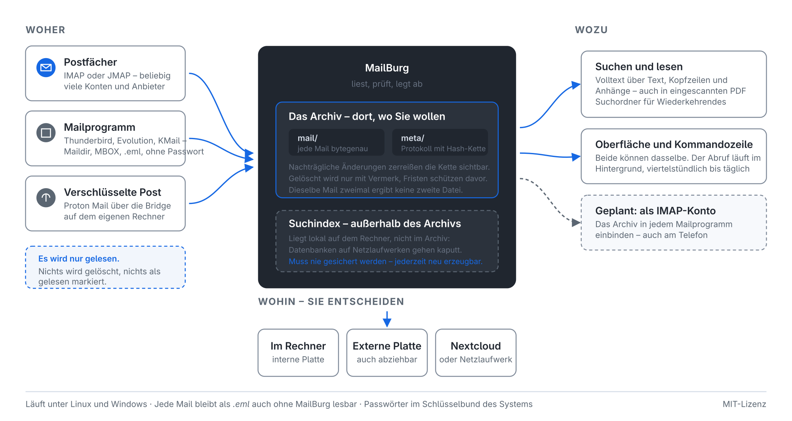
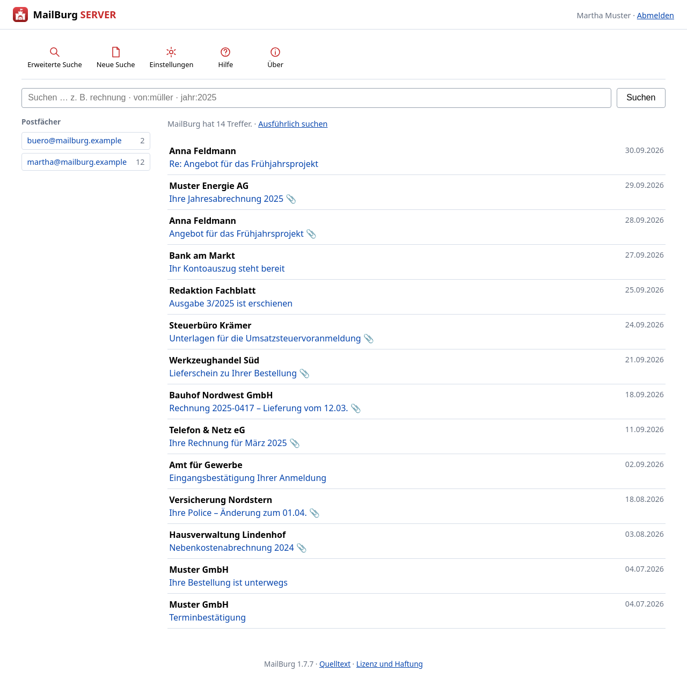
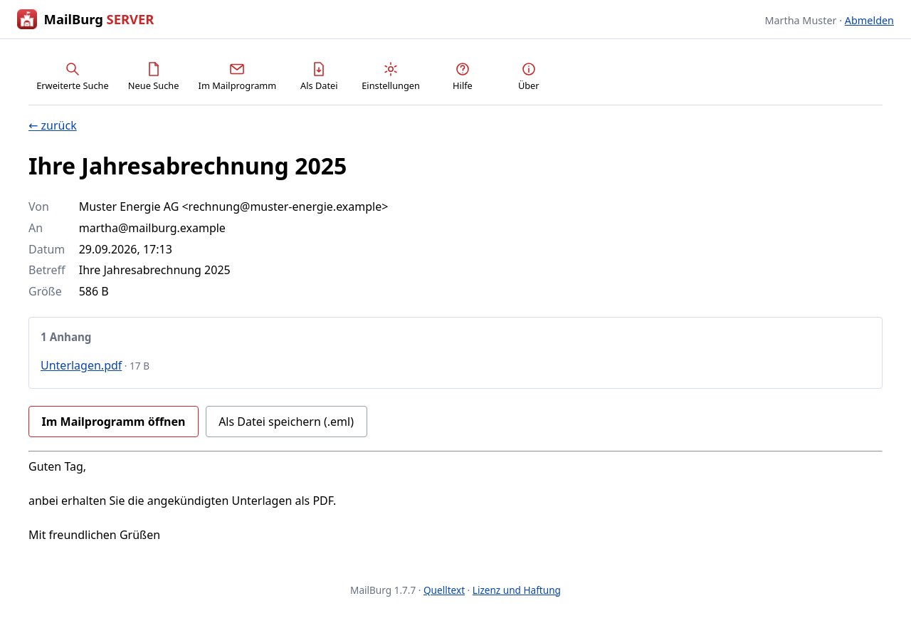
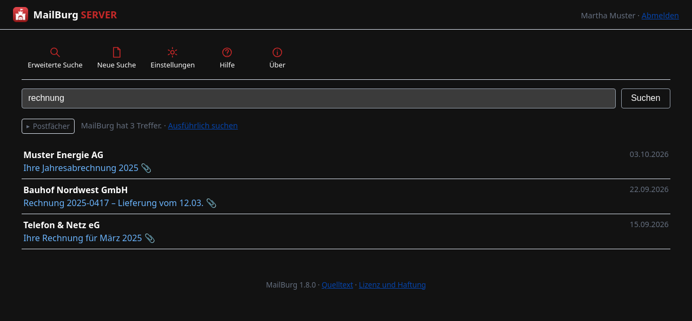

[Deutsch](README.md) | [English](README.en.md) | [Changelog](CHANGELOG.md) | [TODO](TODO.en.md) | [Guides](docs/README.md) | [MailBurg Server](docs/mailburg-server.md) | [Legal](RECHTLICHES.md)

<p align="center">
  <picture>
    <source media="(prefers-color-scheme: dark)" srcset="assets/banner-dark-1600.png">
    
  </picture>
</p>

# MailBurg

An email archive that lives where *you* decide.

MailBurg collects mail from any number of accounts, stores it in one place and
makes it searchable — message bodies, headers and the contents of attachments.
Where that place is, is up to you: internal disk, external disk, a folder
synchronised by Nextcloud.

**Linux and Windows.** Developed and used daily on Linux; on Windows there is
a ready-made `MailBurg.exe` — no Python, no installation, with text
recognition built in, and setup, retrieval, search and scheduled background
retrieval have all been exercised there.

**macOS is not there yet.** The test suite and the setup demonstrably pass,
but nobody has actually used MailBurg on macOS. For an archiving program that
is too little to recommend it: what goes wrong during capture only surfaces
years later. **It hangs on having a machine to verify it on**, not on a
version number — until there is one, this paragraph stays.

<p align="center">
  
</p>

<sub>Die Grafik ist auf Deutsch – wie die Oberfläche und die Suchsprache.</sub>

## Two guises – which one is yours?

The same program, the same archive format, two ways in. Told apart by the
crest: **blue** on your own machine, **red** in a browser. Whichever you
use, you need know nothing about the other.

| |  **MailBurg** |  **MailBurg SERVER** |
|---|---|---|
| **For whom** | one person at their own machine | several people looking into the same archive – a practice, a club, a company |
| **How you get in** | a program window | a browser, from any desk |
| **Start here** | **[Getting started](docs/erste-schritte.md)** (German) – from installing to the first searchable archive, with pictures | **[MailBurg Server](docs/mailburg-server.md)** (German) – setup, operation and maintenance in one place |
| **And then** | [The interface](docs/oberflaeche.md) · [Setting up mailboxes](docs/postfaecher-einrichten.md) · [Backups](docs/sicherung.md) · [On Windows](docs/windows.md) (German) | [Windows Server](docs/server-windows.md) · [Linux](docs/server-einrichten.md) · [Accounts and rights](docs/server-einrichten.md#3-zugänge-anlegen) · [The reasoning](docs/server.md) (German) |

The differences in detail – what the red one deliberately cannot do – are
under [Blue or red](#blue-or-red--which-one-do-you-need).

## Why

Good tools exist for this, but they have limits: Windows only, a cap on the
number of accounts, or an archive format you cannot get your mail out of
without the program itself.

MailBurg does the opposite:

- **No limit on accounts.** Thirty addresses is the design target; more is fine.
- **Your archive, an open format.** Every message is a plain `.eml` file. You
  can reach any of them without MailBurg.
- **The search index is disposable.** It can be rebuilt from the archive at any
  time, so it never needs backing up.
- **Encryption for mail that leaves the house.** Optional at creation time:
  messages and journal are then written encrypted, file names masked. Plus a
  recovery key to print — an archive outlasts decades, a passphrase in your
  head does not.

## Status

**Version 1.8.1, in daily use.** Archive format, IMAP retrieval, search
including saved searches, the graphical interface, text recognition for
scanned PDFs, backups and scheduled retrieval are all in place and used every
day — on Linux with a corpus of around 68,000 messages, on Windows with the
ready-made `MailBurg.exe`.

**Gmail has been exercised against real accounts since 2026-09-22** — three
mailboxes side by side, using app passwords. It also showed that MailBurg gets
multi-location storage right: 189 messages carried several labels and still sit
on disk exactly once.

OAuth2 is implemented, but still only tested against a mock provider: nobody
has yet signed in with a real Microsoft or Google account. With Google you do
not need it — an app password does the job. With **Microsoft there is no other
route**: password sign-in is switched off and app passwords no longer exist. If
you have an Outlook or Microsoft 365 account and would like to help test, you
are very welcome.

Encrypted archives have been available since 2026-08-31 — built and tested,
but not yet exercised in daily use. See
[docs/verschluesselung.md](docs/verschluesselung.md) (German).

[JMAP](docs/jmap.md) arrived on 2026-09-01 and first ran against a real
server on 2026-09-03: around 5,000 messages from a self-hosted Stalwart,
200 of them in under five seconds. Nobody has tried it with Fastmail yet.

For Debian 13 and GuideOS a ready-made `.deb` is attached to every release,
for Windows the `MailBurg.exe`, for everything else an AppImage. Still
missing: Outlook `.pst`, the `.dmg`, and verified operation on macOS. Full
list in [TODO.en.md](TODO.en.md).

## How it works

An archive is a directory:

```
MyArchive/
├── archive.json     identity, operating mode, retention policy
├── mail/            the messages, by month
│   └── 2026/08/3f/3f8a9c1e….eml.zst
└── meta/            the journal with its hash chain
```

Each message is named after the SHA-256 of its content. Two consequences:
importing the same source twice creates no second copy, and a corrupted file
announces itself on read.

Messages are stored **byte for byte** as received — no normalised line endings,
no repaired headers. That is what keeps a DKIM signature verifiable.

### Two operating modes

**Private archive.** No retention periods, no overhead, delete whenever you
like. This matches the law: someone archiving only their own mail falls under
the GDPR household exemption and is not subject to the regulation at all.

**Business archive.** Every operation enters a hash chain — each entry carries
the hash of its predecessor, so tampering visibly breaks the chain. Deletion
works through tombstones: the content goes, the record of its removal stays.
That satisfies the right to erasure and immutability at the same time.
Retention periods for Germany, Austria and Switzerland guard against deleting
too early.

> **Important:** MailBurg *supports* audit-proof operation, it does not
> *establish* it. That also requires process documentation and organisational
> discipline. No software alone can deliver this. See
> [RECHTLICHES.md](RECHTLICHES.md) (German).

### Searching

The query language is German and runs over two indexes:

```
rechnung                    anywhere in body, subject or attachment
von:müller rechnung         both must match
betreff:"offene posten"     quote multi-word phrases
hat:anhang typ:pdf jahr:2025
konto:firma ordner:Gesendet
-werbung                    excludes matches
```

`betreff:rechnung` also finds **Schluss**rechnung. In German that is not a
special case but the norm — we run words together. Hence a second index over
character trigrams alongside the word index. And `von:muller` finds "Müller"
too, for when the umlaut is hard to type.

**Measured on a real corpus:** 68,000 messages, 19.5 GB of raw mail, just
under 1 GB of search index. A search from the window — counting the hits *and*
fetching the first page — takes **2 to 61 milliseconds**, even where 39,000
messages match. Asking for every hit at once costs at most 0.4 seconds.

The index sits on the internal disk while the archive itself lives on an
external one: that disk is only read when you open a message.

### Where the mail comes from

From **IMAP mailboxes** — almost everywhere —, from Thunderbird profiles,
Maildir directories (which is how **Evolution** stores its local folders),
MBOX files and **folders full of `.eml` files** — nested ones included, and
Apple Mail's `.emlx` counts too. That is the route for anything another
program once exported one message at a time. Everything on disk goes through
*Post → Lokale Mailordner einlesen …*; the dialog suggests what it finds on
the machine — classically installed as well as via Flatpak or Snap — and shows
what it recognised before you start. And recently over
**[JMAP](docs/jmap.md)** (German), the successor to IMAP: it answers in one
request what has arrived since the last run, rather than inferring it from
message numbers. Supported so far by Fastmail, Stalwart and Cyrus — not by
Gmail, Outlook, GMX, Web.de or Proton.

The retrieval path belongs to the individual mailbox: one account over JMAP
and the rest over IMAP is intended.

When a matter went back and forth, MailBurg shows the **whole conversation**
for any message in it — held together by the headers every mail client carries,
not by the subject. Subjects change along the way, and two messages with
"Invoice" in the subject usually have nothing to do with each other.

A search you need again and again can be given a name and then sits in the tree
on the left: **saved searches**, the way Evolution has them and Thunderbird
calls them "virtual folders". They hold no mail — they show whatever currently
matches, and so they are always up to date. Anyone used to sorting mail into
local folders works the other way round here: the mail is not moved, the
question is asked. Available on the command line too: `mailburg suchordner`.

### And back out again

An archive nothing comes back out of would be a grave. A single message goes
back via the right mouse button — into the mail client, into any mailbox, or
as an `.eml` file on disk.

For whole mailboxes there is *Post → Ins Dateisystem zurückspielen …*, or
`mailburg zurueckspielen`: as **Maildir** (byte-exact, read state included),
as **MBOX** (the format of Thunderbird's local folders), as individual `.eml`
files — or **back into a mailbox over IMAP**, including one other than where
the mail came from.

The archive stays unchanged, and **running it twice writes nothing twice**:
on disk MailBurg recognises its own files by name, in a mailbox it compares
the `Message-ID` against what is already there. See
[docs/zurueckspielen.md](docs/zurueckspielen.md) (German).

## Getting started

**Ubuntu 24.04, Linux Mint 22, Fedora, Arch, openSUSE:** the **AppImage**.
One file, make it executable, run it. No Python, no package manager.

```bash
chmod +x MailBurg-x86_64.AppImage
./MailBurg-x86_64.AppImage
```

It is attached to every
[release](https://github.com/Stephan-Lefty/MailBurg/releases). Put it in a
permanent place before setting up scheduled retrieval — the schedule
remembers where the file is.

> **Not on Ubuntu 22.04, Linux Mint 21 or Debian 12.** Those systems lack
> both: an SQLite new enough to create MailBurg's search index (measured on
> 2026-09-16: 3.37 and 3.40, 3.45 or later is required) and the system
> libraries the AppImage depends on. **MailBurg does not run there** — and
> it says so on the first archive rather than crashing.

**Debian 13 and GuideOS:** there the `.deb` is the better route, because it
takes the interface from the distribution and thus receives its security
updates.

```bash
sudo apt install ./mailburg_*_all.deb
```

> **Only there.** Ubuntu, Linux Mint, Pop!\_OS and Zorin do not carry PySide6
> in their archives. `apt` will install MailBurg there, but **without the
> interface** — you get a menu entry with no window behind it. On those
> systems, use the AppImage.

It pulls the interface, the keyring and the PDF tools from the distribution —
MailBurg ships no Qt of its own, so that security updates arrive through
`apt`.

**Everywhere else.** Requires Python 3.11 or newer; the core needs no further
packages.

```bash
git clone https://github.com/Stephan-Lefty/MailBurg.git
cd MailBurg
./install.sh
```

This sets MailBurg up inside your home directory — no administrator rights, no
changes to the system — and creates the `mailburg` command. On Windows,
`.\install.ps1` does the same; see [docs/windows.md](docs/windows.md).
`./install.sh --entfernen` removes it again, leaving the archive untouched.

If you would rather decide where things go, use `pip install ".[alles]"` — or
skip installing altogether and run `python3 -m mailburg` from the source
directory.

Note that the command names are German throughout: `anlegen` (create),
`importieren` (import), `abrufen` (fetch), `suchen` (search), `pruefen`
(verify), `konten` (accounts).

```bash
mailburg anlegen ~/Archive --modus privat
mailburg importieren ~/Archive ~/.thunderbird/xxxx.default --konto private
mailburg suchen ~/Archive betreff:rechnung jahr:2025
mailburg info ~/Archive
mailburg pruefen ~/Archive
```

Sources can be a Thunderbird profile, a Maildir directory, a single MBOX file
or a folder full of `.eml` files. Thunderbird profiles are imported with all
accounts and their nested folder structure.

**Trash, suspected spam and drafts stay out** — as they do when fetching from
a mailbox. What was skipped is named at the end of the run; `--alles` takes it
along.

## Fetching from mailboxes

For ongoing archiving, MailBurg collects mail straight from the mailbox:

```bash
# Set up a mailbox — the password is prompted for, never passed as an argument
mailburg konten hinzufuegen Firma \
    --server imap.example.org --benutzer post@example.org

# See what is configured and which folders would be archived
mailburg konten liste
mailburg konten pruefen Firma

# Fetch — everything the first time, only what is new afterwards
mailburg abrufen ~/Archive
mailburg abrufen ~/Archive --konto Firma
```

This is meant for scheduling: `mailburg abrufen ~/Archive` in a nightly cron job
is all it takes.

**Your mailbox stays untouched.** Every folder is opened read-only and messages
are fetched with `BODY.PEEK[]`. Unread mail is still unread afterwards — an
archiver that gets this wrong is worse than useless.

**Passwords live in the operating system's keyring**, never in a configuration
file. This needs the `keyring` package; without it everything still runs, the
password is simply asked for on every fetch. It is not written to the account
list either way.

Gmail, GMX and Web.de do not accept your web password for outside access — they
require an app-specific password. Outlook and Microsoft 365 go further: app
passwords are gone there, and IMAP works only via OAuth2. That path is built,
but has only been tested against a mock provider — see
[docs/oauth2.md](docs/oauth2.md) (German).

**What is skipped:** trash, spam and drafts. The user already sorted that mail
out once; pulling it into the archive would undo that decision. On Gmail, "All
Mail" is skipped as well — it contains every message a second time.

**Only what is new.** How MailBurg knows where it left off is the genuinely
delicate part: the high-water mark is not written down, it is read back out of
the archive itself. If a fetch is interrupted mid-folder, the next one picks up
exactly the remainder. And a single message MailBurg choked on is flagged and
requested again next time — otherwise it would be missing forever, with nobody
any the wiser.

### Before you clear out your mailbox

**Is everything really in the archive?** That question is answered by *Post →
Ist alles im Archiv? …* in the window, or `mailburg abgleich` on the command
line. MailBurg then asks every mailbox which messages there are older than a
cut-off date, and holds **every single one** against the archive.

This is not the same as `mailburg pruefen`: that check tells you whether the
archive is intact. Whether *everything* is in it, it cannot know — **an archive
cannot check what it never saw.**

The verdict reads "all present" only when that is beyond doubt. A mailbox that
does not answer, or a server that has reassigned its message numbers, keeps it
open — even if every other mailbox is complete. Clear out because nine of ten
mailboxes looked fine, and you lose the tenth one's mail in both places.

The full procedure is in
[docs/postfach-entlasten.md](docs/postfach-entlasten.md) (German).

## In the browser, when more than one person needs access

Where the archive is not for one person alone — a practice, a club, a company —
MailBurg can run as a service. The archive then sits on a machine that stays on,
and everyone else reaches it through a browser: sign in, search, read, download
attachments.

<p align="center">
  
</p>

A message opened – with its attachment, »open in mail client« and
»save as file«:

<p align="center">
  
</p>

**Light and dark** is each account's own choice – top right, or under
*Einstellungen*. The default follows the operating system.

<p align="center">
  
</p>

<sub>Die Oberfläche ist auf Deutsch – wie die Suchsprache.</sub>

**Who may see what is recorded in the archive itself**, not in the service. An
account can be restricted to certain mailboxes, and the restriction takes effect
*inside* the query: someone barred from accounting does not even get a result
count they could infer from.

**Read-only.** Classifying, deleting and restoring to a mailbox stay with the
command line and the desktop window — those are the operations that write to the
journal.

**By default the service listens on the local machine only.** On a server
without a screen you therefore reach it through an SSH tunnel
(`ssh -L 8383:127.0.0.1:8383 user@server`), and on a company network through a
reverse proxy with TLS. An archive service that stands on the whole network
unasked at first start would be a nasty surprise.

### Blue or red – which one do you need?

The same program comes in two guises, told apart by the crest: **blue** on a
workstation, **red** in the browser.

| |  **MailBurg** |  **MailBurg SERVER** |
|---|---|---|
| Where it runs | on your own machine | on a server that stays up |
| How you reach it | a window | a browser, from any desk |
| Who uses it | one person | several, each with their own rights |
| Fetching mail | yes | yes |
| Searching and reading | yes | yes |
| Classifying, deleting, putting back | yes | **no** – those write to the journal |
| Install on each desk | yes | **none** |
| Updating | per machine | once on the server, for everyone |

**Both work on the same archive format.** An archive created on a workstation
can be copied to a server and back – it is an ordinary folder.

**Not both on the same archive at once.** Two programs writing into it break
the hash chain; whoever moves to a server turns off fetching on the
workstation. So the choice is less about features than about how many people
need to look inside.

The path from a bare machine:

* [Setting up the archive in the browser](docs/server-einrichten.md) (German) –
  Debian and other Linux systems, service via systemd. Walked through.
* [MailBurg on a Windows Server](docs/server-windows.md) (German) – with a
  setup window instead of typed commands. Walked through on Windows Server
  2025 on 2026-10-02, including a reboot.
* [The reasoning behind it](docs/server.md) (German).

## On Nextcloud

An archive inside a synchronised folder works because the storage layout is
built for it: one file per message, and old month folders never change again —
so they sync exactly once.

The **search index deliberately lives outside the archive**, in the local
application directory. SQLite on a synchronised drive will eventually corrupt;
that is the most common way people destroy an archive. Nothing is lost when it
does — `neuaufbau` recreates the index in minutes.

While one machine has the archive open, a lock file sits inside it. Two
machines writing at once would otherwise produce a sync conflict nobody can
resolve.

## Tests

```bash
python3 tests/lauf.py
```

This is `unittest discover` with a clean ending: the runner exits the
process itself, before Python tears down its modules and Qt trips over
its own feet. Without it the suite aborts on some systems **after** the
last test, even though every test reported green. The exit code is the
usual one: 0 on success, 1 on any failure.

To hunt for errors that only surface during teardown, take the ordinary
route:

```bash
python3 -m unittest discover -s tests -v
```

## Licence

MIT — see [LICENSE](LICENSE).
