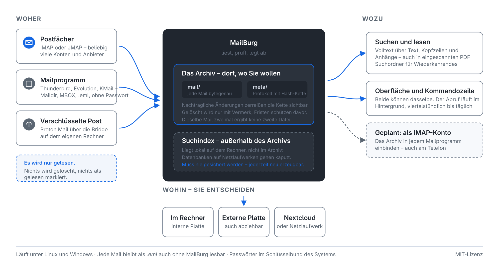

[Deutsch](README.md) | [English](README.en.md) | [Änderungsprotokoll](CHANGELOG.md) | [TODO](TODO.md) | [Anleitungen](docs/README.md) | [Rechtliches](RECHTLICHES.md)

<p align="center">
  <picture>
    <source media="(prefers-color-scheme: dark)" srcset="assets/banner-dark-1600.png">
    
  </picture>
</p>

# MailBurg

Ein Archiv für E-Mail, das an den Ort gehört, den Sie bestimmen.

MailBurg holt Ihre Post aus beliebig vielen Postfächern zusammen, legt sie an
einer Stelle ab und macht sie durchsuchbar – Mailtexte, Kopfzeilen und den
Inhalt der Anhänge. Wo dieser eine Ort liegt, entscheiden Sie: interne Platte,
externe Platte, ein von Nextcloud synchronisierter Ordner.

**Linux und Windows.** Entwickelt und im Alltag erprobt unter Linux; unter
Windows gibt es eine fertige `MailBurg.exe` – ohne Python, ohne Installation,
mit eingebauter Texterkennung, und Einrichtung, Abruf, Suche sowie der
regelmäßige Abruf über die Aufgabenplanung sind dort durchgespielt.

**macOS ist noch nicht dran.** Tests und Einrichtung laufen dort nachweislich
durch, benutzt hat MailBurg dort aber noch niemand. Für ein Archivprogramm ist
das zu wenig, um es zu empfehlen: Was beim Aufnehmen schiefgeht, fällt erst
Jahre später auf. macOS ist deshalb für die Fassung 1.1 vorgesehen, mit einem
Gerät zum Prüfen.

<p align="center">
  
</p>

**Neu hier?** [Erste Schritte](docs/erste-schritte.md) führt mit Bildern von der Installation bis zum ersten durchsuchbaren Archiv. [Die Oberfläche](docs/oberflaeche.md) erklärt jedes Fenster und jeden Menüpunkt.

## Warum

Es gibt gute Programme für diese Aufgabe, aber sie haben Grenzen: Sie laufen
nur unter Windows, sie beschränken die Zahl der Konten, oder sie sperren das
Archiv in ein Format, aus dem man es ohne das Programm nicht wieder herausbekommt.

MailBurg macht es andersherum:

- **Keine Beschränkung der Kontenzahl.** Dreißig Adressen sind vorgesehen, mehr
  ist kein Problem.
- **Ihr Archiv, Ihr Format.** Jede Mail liegt als einzelne `.eml`-Datei. Auch
  ohne MailBurg kommen Sie an jede einzelne heran.
- **Der Suchindex ist wegwerfbar.** Er lässt sich jederzeit vollständig aus dem
  Archiv neu erzeugen und muss deshalb nicht gesichert werden.
- **Verschlüsseln, wenn die Post das Haus verlässt.** Wahlweise beim Anlegen:
  Mails und Protokoll wandern dann verschlüsselt auf die Platte, samt
  verdeckter Dateinamen. Dazu ein Notschlüssel zum Ausdrucken – ein Archiv
  überdauert Jahrzehnte, ein Passwort im Kopf nicht.

## Stand

**Fassung 1.3.0, im Alltag im Einsatz.** Archivformat, IMAP-Abruf, Suche,
Oberfläche, Texterkennung für eingescannte PDF, Sicherung und der regelmäßige
Abruf im Hintergrund stehen und werden täglich benutzt – unter Linux mit einem
Bestand von über 16.000 Mails, unter Windows mit der fertigen `MailBurg.exe`.

OAuth2 ist gebaut, aber nur gegen einen nachgebauten Anbieter geprüft: Bei
einem echten Microsoft- oder Google-Konto hat sich damit noch niemand
angemeldet. Wer dort abruft, nimmt vorerst besser ein App-Passwort.

Verschlüsselte Archive gibt es seit dem 31.08.2026 – gebaut und getestet,
aber im Alltag noch nicht erprobt. Siehe
[docs/verschluesselung.md](docs/verschluesselung.md).

[JMAP](docs/jmap.md) ist seit dem 01.09.2026 dabei und am 03.09.2026 zum
ersten Mal gegen einen echten Server gelaufen: rund 5.000 Nachrichten aus
einem selbst betriebenen Stalwart, 200 davon in unter fünf Sekunden. Bei
Fastmail hat es noch niemand ausprobiert.

Was noch fehlt: Outlook-`.pst`, fertige Pakete (`.deb`, AppImage, `.dmg`)
und der erprobte Betrieb unter macOS. Die vollständige Liste steht in
[TODO.md](TODO.md).

## Wie es funktioniert

Ein Archiv ist ein Verzeichnis:

```
MeinArchiv/
├── archive.json     Kennung, Betriebsart, Fristenregel
├── mail/            die Mails, nach Monat sortiert
│   └── 2026/08/3f/3f8a9c1e….eml.zst
└── meta/            das Journal mit der Hash-Kette
```

Der Dateiname jeder Mail ist der SHA-256 ihres Inhalts. Das hat zwei Folgen:
Dieselbe Mail zweimal einzulesen erzeugt keine zweite Datei, und eine
beschädigte Datei fällt beim Lesen von selbst auf.

Die Mail wird dabei **bytegenau** abgelegt – keine geglätteten Zeilenenden,
keine reparierten Kopfzeilen. Nur so bleibt eine DKIM-Signatur später noch
prüfbar.

### Zwei Betriebsarten

Beim Anlegen entscheiden Sie, worum es geht:

**Privatarchiv.** Keine Fristen, kein Ballast, löschen jederzeit. Das entspricht
der Rechtslage: Wer ausschließlich eigene Mails archiviert, fällt unter die
Haushaltsausnahme der DSGVO und unterliegt ihr gar nicht.

**Geschäftsarchiv.** Jeder Vorgang wandert in eine Hash-Kette – jeder Eintrag
trägt den Hash seines Vorgängers. Wer nachträglich etwas ändert, zerreißt die
Kette sichtbar. Gelöscht wird nur über Grabsteine: Der Inhalt verschwindet, der
Vorgang bleibt protokolliert. So lassen sich das Recht auf Löschung und die
Unveränderbarkeit gleichzeitig erfüllen. Aufbewahrungsfristen für Deutschland,
Österreich und die Schweiz bremsen zu frühes Löschen.

> **Wichtig:** MailBurg *unterstützt* einen revisionssicheren Betrieb, es
> *stellt ihn nicht her*. Dazu gehören eine Verfahrensdokumentation und
> geregelte Abläufe. Eine Software allein kann das nicht leisten. Mehr dazu in
> [RECHTLICHES.md](RECHTLICHES.md).

### Suchen

Die Suche ist deutsch und läuft über zwei Indizes:

```
rechnung                    irgendwo in Text, Betreff oder Anhang
von:müller rechnung         beides muss zutreffen
betreff:"offene posten"     mehrere Wörter in Anführungszeichen
hat:anhang typ:pdf jahr:2025
konto:firma ordner:Gesendet
-werbung                    schließt Treffer aus
```

`betreff:rechnung` findet auch **Schluss**rechnung. Das ist kein Sonderwunsch,
sondern im Deutschen der Normalfall – wir schreiben zusammen. Dafür gibt es
neben dem Wortindex einen zweiten über Dreizeichengruppen.

Auch die Schreibweise darf abweichen: `von:muller` und `von:mueller` finden
beide „Müller", `bahnhofstrasse` findet „Bahnhofstraße". Groß- und
Kleinschreibung spielt nirgends eine Rolle.

### Woher die Post kommt

Aus **IMAP-Postfächern** – so gut wie überall –, aus Thunderbird-Profilen,
Maildir-Verzeichnissen (so legt **Evolution** seine lokalen Ordner ab) und
MBOX-Dateien. Für alles von der Platte gibt es *Post → Lokale Mailordner
einlesen …*; der Dialog schlägt vor, was er auf dem Rechner findet, und zeigt
vor dem Start, was er dort erkannt hat. Und seit Kurzem über
**[JMAP](docs/jmap.md)**, den Nachfolger von IMAP: Er beantwortet in einer
Anfrage, was seit dem letzten Abruf dazugekommen ist, statt es aus
Nachrichtennummern zu erraten. Können bisher Fastmail, Stalwart und Cyrus –
Gmail, Outlook, GMX, Web.de und Proton nicht.

Der Abrufweg gehört zum einzelnen Postfach: ein Konto über JMAP und die
übrigen weiter über IMAP ist vorgesehen.

Ging eine Sache mehrmals hin und her, zeigt MailBurg zu jeder Nachricht den
**ganzen Gesprächsverlauf** – zusammengehalten über die Kopfzeilen, die jedes
Mailprogramm mitführt, nicht über den Betreff. Der wechselt unterwegs, und
zwei Mails mit „Rechnung" im Betreff haben meistens nichts miteinander zu tun.

### Und wieder hinaus

Ein Archiv, aus dem nichts wieder herauskommt, wäre ein Grab. Eine einzelne
Nachricht geht über die rechte Maustaste zurück – ins Mailprogramm, in ein
beliebiges Postfach oder als `.eml` auf die Platte.

Für ganze Postfächer gibt es *Post → Ins Dateisystem zurückspielen …*
beziehungsweise `mailburg zurueckspielen`: als **Maildir** (bytegenau, mit
Lesezustand), als **MBOX** (das Format von Thunderbirds lokalen Ordnern), als
einzelne `.eml` – oder **über IMAP zurück in ein Postfach**, auch in ein
anderes als das, aus dem die Post stammt.

Das Archiv bleibt dabei unverändert, und **zweimal zurückspielen schreibt
nichts doppelt**: auf der Platte erkennt MailBurg seine eigenen Dateien am
Namen, im Postfach vergleicht es die `Message-ID` mit dem, was dort schon
liegt. Siehe [docs/zurueckspielen.md](docs/zurueckspielen.md).

## Loslegen

Voraussetzung ist Python 3.11 oder neuer. Weitere Pakete braucht der Kern nicht.

```bash
git clone https://github.com/Stephan-Lefty/MailBurg.git
cd MailBurg
./install.sh
```

Das richtet MailBurg im Benutzerverzeichnis ein – ohne Administratorrechte, ohne
etwas am System zu ändern – und legt den Befehl `mailburg` an. Unter Windows
übernimmt das `.\install.ps1`, siehe [docs/windows.md](docs/windows.md).
`./install.sh --entfernen` baut alles wieder ab; das Archiv bleibt dabei
unangetastet.

Wer lieber selbst bestimmt, wohin es geht, nimmt `pip install ".[alles]"` – oder
lässt die Installation ganz weg und ruft `python3 -m mailburg` direkt im
Quellverzeichnis auf.

**Wenn Sie einzelne Zusätze wählen:** Der Kern kommt ohne Fremdpakete aus, aber
er kann dann auch nur das Nötigste. Was wozu gehört:

| Zusatz | wofür | ohne ihn |
|---|---|---|
| `oberflaeche` | das Fenster, PySide6 | nur die Kommandozeile |
| `imap` | Postfächer abrufen, Passwörter im Schlüsselbund | kein IMAP |
| `anhaenge` | Text aus PDF und Büroformaten | Anhänge bleiben unauffindbar |
| `packen` | kleinere Sicherungen (Zstandard) | LZMA, langsamer |
| `verschluesselung` | verschlüsselte Archive | nur unverschlüsselt |

`pip install ".[oberflaeche]"` genügt also nicht, um Postfächer abzurufen –
dafür braucht es `imap` dazu. Am einfachsten ist `".[alles]"`.

```bash
# Archiv anlegen
mailburg anlegen ~/Archiv --modus privat

# Thunderbird-Profil einlesen (findet die Ordnerstruktur von selbst)
mailburg importieren ~/Archiv ~/.thunderbird/xxxx.default --konto privat

# Suchen
mailburg suchen ~/Archiv betreff:rechnung jahr:2025

# Nachsehen, was drin ist
mailburg info ~/Archiv

# Hash-Kette und Ablage prüfen
mailburg pruefen ~/Archiv
```

`mailburg suchhilfe` erklärt die Suchsprache.

Als Quelle taugt ein Thunderbird-Profil, ein Maildir-Verzeichnis oder eine
einzelne MBOX-Datei. Bei einem Thunderbird-Profil werden alle Konten und Ordner
mitsamt ihrer Verschachtelung übernommen.

## Postfächer abrufen

Für die laufende Archivierung holt MailBurg die Post direkt aus dem Postfach:

```bash
# Postfach einrichten – das Passwort wird abgefragt, nicht als Argument übergeben
mailburg konten hinzufuegen Firma \
    --server imap.example.org --benutzer post@example.org

# Nachsehen, was eingerichtet ist und welche Ordner archiviert würden
mailburg konten liste
mailburg konten pruefen Firma

# Abrufen – beim ersten Mal alles, danach nur noch das Neue
mailburg abrufen ~/Archiv
mailburg abrufen ~/Archiv --konto Firma
```

Der Abruf eignet sich für die Zeitsteuerung: `mailburg abrufen ~/Archiv` in
einem nächtlichen Cron-Auftrag genügt.

**Das Postfach bleibt unangetastet.** MailBurg öffnet jeden Ordner nur lesend
und holt die Mails mit `BODY.PEEK[]`. Ungelesene Post ist hinterher immer noch
ungelesen – ein Archivprogramm, das das nicht einhält, ist unbrauchbar.

**Passwörter stehen im Schlüsselbund** des Betriebssystems, nie in einer
Konfigurationsdatei. Dafür wird das Paket `keyring` gebraucht; fehlt es, läuft
alles weiter, nur wird das Passwort bei jedem Abruf neu erfragt. In die
Kontenliste kommt es auch dann nicht.

Bei Gmail, GMX, Web.de und Outlook genügt das Kennwort der Weboberfläche nicht –
diese Anbieter verlangen für den Zugriff von außen ein eigenes App-Passwort.
Die Anmeldung per OAuth2 gibt es inzwischen ebenfalls, sie ist aber nur gegen
einen nachgebauten Anbieter geprüft – siehe
[Anmeldung per OAuth2](docs/oauth2.md).

**Was übergangen wird:** Papierkorb, Spamverdacht und Entwürfe. Der Anwender hat
diese Post schon einmal aussortiert; sie ins Archiv zu holen, würde diese
Entscheidung rückgängig machen. Bei Gmail bleibt zusätzlich »Alle Nachrichten«
außen vor – dieser Ordner enthält sämtliche Mails ein zweites Mal.

**Nur das Neue.** Woher MailBurg weiß, wo es stehen geblieben ist, ist die
einzige wirklich heikle Stelle daran: Der Höchststand wird nicht mitgeschrieben,
sondern aus dem Archiv selbst abgelesen. Bricht ein Abruf mitten im Ordner ab,
holt der nächste genau den Rest. Und eine einzelne Mail, an der sich MailBurg
verschluckt hat, wird vorgemerkt und beim nächsten Lauf erneut angefordert –
sonst fehlte sie für immer, ohne dass es je jemand bemerkte.

## Im Browser, wenn mehrere darauf zugreifen

Für den Fall, dass nicht nur eine Person an das Archiv soll – eine Kanzlei,
ein Verein, eine Firma –, lässt sich MailBurg als Dienst betreiben. Dann
liegt das Archiv auf einem Rechner, der läuft, und alle anderen erreichen es
über den Browser: anmelden, suchen, lesen, Anhänge herunterladen.

**Wer was sehen darf, steht im Archiv selbst**, nicht beim Dienst. Ein Zugang
kann auf bestimmte Postfächer beschränkt sein, und die Einschränkung wirkt
*in* der Suchabfrage: Wer die Buchhaltung nicht sehen darf, bekommt auch keine
Trefferzahl, aus der er auf sie schließen könnte.

**Gelesen wird nur.** Einstufen, Löschen und das Zurücklegen ins Postfach
bleiben der Kommandozeile und dem Fenster vorbehalten – das sind die Vorgänge,
die ins Journal schreiben.

Der Weg vom leeren Rechner bis dahin steht in
[docs/server-einrichten.md](docs/server-einrichten.md), die Überlegungen
dahinter in [docs/server.md](docs/server.md). Für Debian ist er durchgespielt;
der Windows-Dienst ist gebaut, aber noch nicht erprobt.

## Zu Nextcloud

Ein Archiv in einem synchronisierten Ordner funktioniert, weil die Ablage darauf
ausgelegt ist: Jede Mail ist eine eigene Datei, und alte Monatsordner ändern sich
nie wieder – synchronisiert werden sie also genau einmal.

Der **Suchindex liegt bewusst nicht im Archiv**, sondern lokal im
Anwendungsverzeichnis. SQLite auf einem synchronisierten Laufwerk geht früher
oder später kaputt; das ist der häufigste Weg, sich ein Archiv zu zerschießen.
Verloren geht dabei nichts – der Index entsteht mit `neuaufbau` in Minuten neu.

Solange ein Rechner das Archiv geöffnet hat, liegt eine Sperrdatei darin. Zwei
Rechner, die gleichzeitig hineinschreiben, würden sonst einen
Synchronisationskonflikt erzeugen, den niemand mehr auflösen kann.

## Tests

```bash
python3 -m unittest discover -s tests -v
```

## Lizenz

MIT – siehe [LICENSE](LICENSE).
