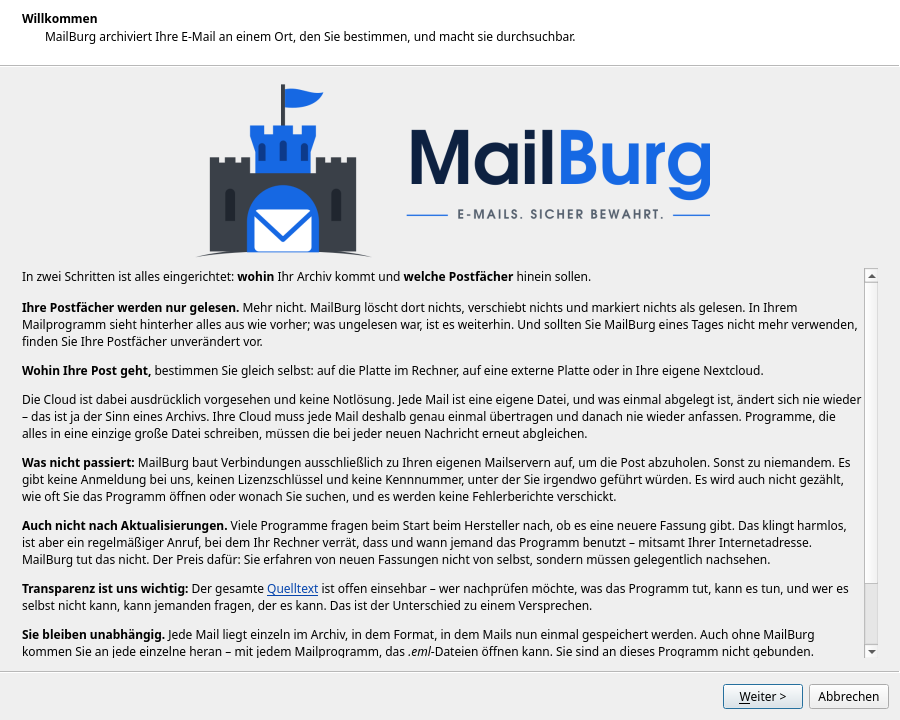
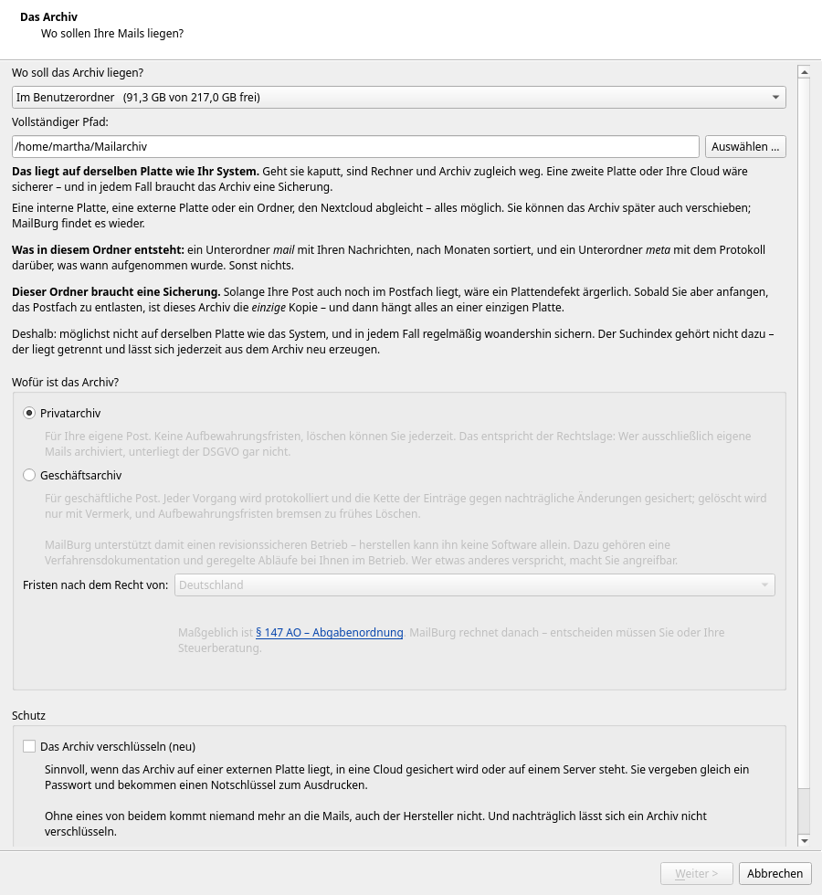
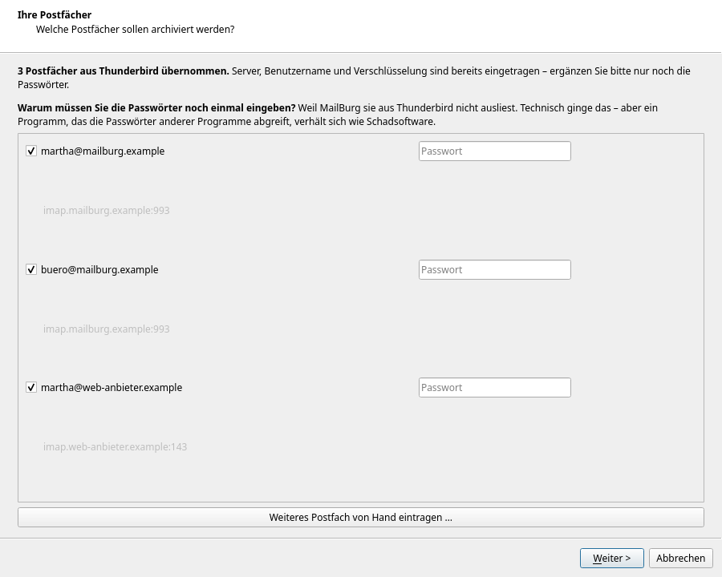
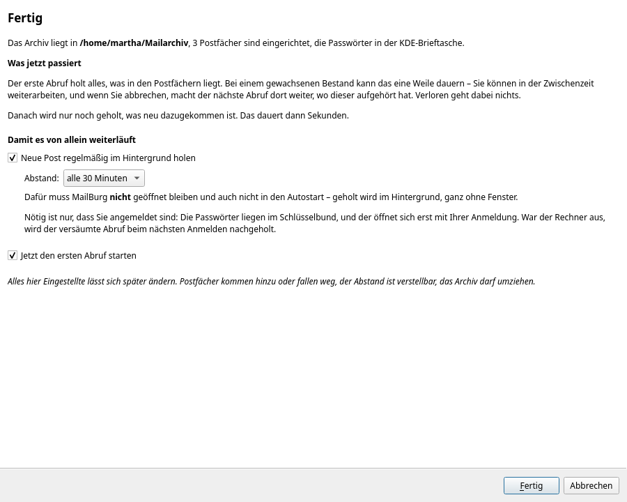
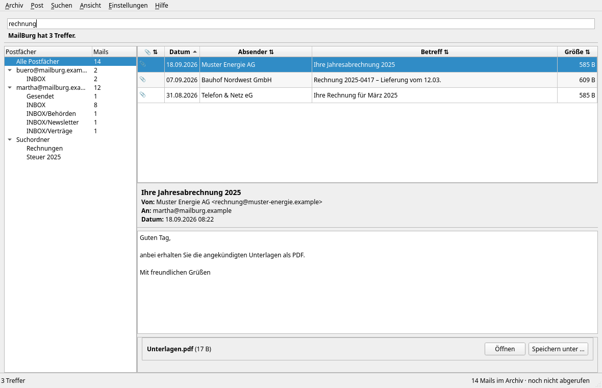

[Übersicht](../README.md) | [Anleitungen](README.md) | [Die Oberfläche](oberflaeche.md) | [Postfach entlasten](postfach-entlasten.md) | [Sichern](sicherung.md)

# Erste Schritte

Von der Installation bis zum ersten durchsuchbaren Archiv. Rechnen Sie mit
zehn Minuten – der erste Abruf läuft danach im Hintergrund weiter.

Alle Bilder in dieser Anleitung zeigen erfundene Postfächer.

## 1. Installieren

### Linux

```bash
git clone https://github.com/Stephan-Lefty/MailBurg.git
cd MailBurg
./install.sh
```

Das Skript legt eine eigene Python-Umgebung an, installiert MailBurg samt
Oberfläche und trägt einen Menüeintrag unter *Büroprogramme* ein. Es fragt
vorher, was es tut, und braucht keine Verwaltungsrechte.

**Rechnen Sie mit fünf bis fünfzehn Minuten.** Der längste Teil ist die
grafische Oberfläche: PySide6 ist rund 150 MB, und je nach Python-Fassung
werden einzelne Pakete erst für Ihr System übersetzt. Der Fortschritt läuft
dabei mit – solange sich etwas bewegt, ist alles in Ordnung.

Danach steht `mailburg` in der Eingabeaufforderung bereit und **MailBurg** im
Anwendungsmenü.

### Windows

Eine Datei herunterladen, doppelklicken, fertig. Python wird nicht gebraucht,
installiert wird nichts, Administratorrechte braucht es nicht.

Die aktuelle `MailBurg.exe` hängt an der
[jüngsten Veröffentlichung](https://github.com/Stephan-Lefty/MailBurg/releases/latest).
Die Texterkennung für eingescannte PDF ist darin bereits enthalten.

Beim ersten Start warnt Windows: „Der Computer wurde durch Windows geschützt."
Das ist zu erwarten — die Datei ist nicht signiert. **Weitere Informationen** →
**Trotzdem ausführen**. Einzelheiten und die Prüfsumme zum Nachrechnen in
[MailBurg unter Windows](windows.md).

### Zwei Werkzeuge, die MailBurg mitbringt

`install.sh` bietet an, zwei Systempakete mitzuinstallieren, und antwortet man
nicht ausdrücklich mit Nein, tut es das auch:

| Paket | wofür |
|---|---|
| **poppler** | holt Text aus PDF – schnell und zuverlässig |
| **tesseract** samt deutschen Sprachdaten | liest *eingescannte* PDF, also Rechnungen, die als Foto einer Seite ankommen |

**Sagen Sie hier möglichst Ja.** Ohne tesseract ist der Inhalt eingescannter
Dokumente für die Suche unsichtbar – nicht langsamer auffindbar, sondern gar
nicht. Und das merkt man erst, wenn man Jahre später vergeblich nach einer
Rechnung sucht, die im Archiv liegt.

Zum Nachrüsten, falls Sie beim ersten Mal abgelehnt haben:

```bash
# Debian, Ubuntu, GuideOS, Mint
sudo apt install poppler-utils tesseract-ocr tesseract-ocr-deu tesseract-ocr-eng

# Arch, Manjaro
sudo pacman -S poppler tesseract tesseract-data-deu tesseract-data-eng

# Fedora
sudo dnf install poppler-utils tesseract tesseract-langpack-deu

# openSUSE
sudo zypper install poppler-tools tesseract-ocr tesseract-ocr-traineddata-german

# macOS
brew install poppler tesseract tesseract-lang
```

Ob es geklappt hat, sagt Ihnen:

```bash
tesseract --list-langs
```

Steht dort `deu`, ist alles bereit. In der Windows-Fassung sind beide Werkzeuge
samt deutschen Sprachdaten bereits eingepackt — dort genügt
`MailBurg.exe werkzeuge`, um es nachzusehen. Einzelheiten in
[MailBurg unter Windows](windows.md).

**Ohne diese Pakete läuft MailBurg vollständig** – Abrufen, Suchen,
Aufbewahrungsfristen, Sicherung. Nur Bilder von Seiten bleiben stumm.

### Und die Python-Zusätze

Das gilt für die beiden Systemprogramme oben. MailBurg selbst kennt daneben
vier Zusätze, die `install.sh` alle mitinstalliert – wer stattdessen `pip`
benutzt, wählt sie selbst:

| Zusatz | wofür |
|---|---|
| `oberflaeche` | das Fenster (PySide6) |
| `imap` | Postfächer abrufen, Passwörter im Schlüsselbund |
| `anhaenge` | Text aus PDF und Büroformaten |
| `packen` | kleinere Sicherungen (Zstandard) |

```bash
pip install "mailburg[alles]"        # alles auf einmal
pip install "mailburg[oberflaeche,imap]"   # nur Fenster und Abruf
```

**`oberflaeche` allein genügt nicht zum Abrufen.** Heraus käme ein Programm,
das Postfächer einrichten kann, aber keine Passwörter behält – dafür sorgt
`imap`.

## 2. Der erste Start

Beim ersten Aufruf von **MailBurg** führt ein Assistent durch die Einrichtung.



Hier steht, was MailBurg tut und was nicht. Lesen Sie es einmal – es ist die
Grundlage dafür, ob Sie dem Programm Ihre Post anvertrauen wollen.

## 3. Wo das Archiv liegen soll



MailBurg schlägt Orte vor und zeigt, wie viel Platz dort frei ist. **Wählen
Sie möglichst nicht die Platte, auf der Ihr Betriebssystem liegt** – geht die
kaputt, wäre sonst beides weg. Eine externe Platte ist eine gute Wahl.

Darunter entscheiden Sie zwischen zwei Betriebsarten:

**Privatarchiv** – keine Aufbewahrungsfristen, löschen jederzeit möglich. Das
entspricht der Rechtslage: Wer ausschließlich eigene Post archiviert,
unterliegt der DSGVO gar nicht.

**Geschäftsarchiv** – jeder Vorgang wird protokolliert, die Kette der Einträge
gegen nachträgliche Änderungen gesichert, gelöscht wird nur mit Vermerk.
Außerdem gelten die Aufbewahrungsfristen des gewählten Rechtsraums
(Deutschland, Österreich, Schweiz).

> **Führen Sie im Zweifel zwei Archive.** Geschäftliche Post gehört ins
> Geschäftsarchiv, private ins Privatarchiv. Das ist keine Ordnungsliebe: Ein
> Geschäftsarchiv bremst das Löschen jahrelang, während die DSGVO für
> Gesundheitsdaten und Ähnliches das Gegenteil verlangt.

## 4. Postfächer



Ist Thunderbird installiert, liest MailBurg dessen Einstellungen aus – Server,
Benutzername und Verschlüsselung stehen dann schon da.

**Die Passwörter müssen Sie einmal von Hand eingeben.** Technisch ließen sie
sich mitlesen, aber ein Programm, das die Passwörter anderer Programme
abgreift, verhält sich wie Schadsoftware. Einem Archiv vertrauen Sie
jahrzehntealte Post an; dieses Vertrauen ist mehr wert als die gesparte
Tipparbeit.

Abgelegt werden sie im Schlüsselbund Ihres Systems – KDE-Brieftasche,
GNOME-Schlüsselbund, Windows-Anmeldeinformationsverwaltung –, nie in einer
Datei des Programms.

Jedes Postfach wird sofort ausprobiert. Sie sehen also gleich, ob es klappt.

**Wenn ein Zertifikat abgelehnt wird:** Läuft Ihr Mailserver bei einem größeren
Anbieter, weist er sich oft unter dessen Namen aus. MailBurg sieht dann nach,
für welchen Namen das Zertifikat gilt, und schlägt ihn vor. Nehmen Sie den
Vorschlag an – danach ist die Verbindung vollständig geprüft. Eine Möglichkeit,
die Prüfung einfach abzuschalten, gibt es bewusst nicht.

Postfächer ohne Thunderbird tragen Sie über **Weiteres Postfach von Hand
eintragen …** ein. Einzelheiten zu App-Passwörtern bei Gmail, GMX und Web.de
stehen in [Postfächer einrichten](postfaecher-einrichten.md) — dort steht auch,
warum Microsoft-Konten derzeit nicht gehen. Zu Proton
in derselben Anleitung.

## 5. Fertig



Hier lässt sich gleich einstellen, dass MailBurg regelmäßig im Hintergrund
abruft. Dafür muss das Programm weder geöffnet bleiben noch mitstarten – nötig
ist nur, dass Sie angemeldet sind, weil daran der Schlüsselbund hängt.

Der erste Abruf holt alles. Bei einem gewachsenen Bestand dauert das; Sie
können weiterarbeiten, und wenn Sie abbrechen, macht der nächste Lauf dort
weiter.

## 6. Suchen



Schreiben Sie einfach hinein, wonach Sie suchen. Gesucht wird in Betreff,
Text, Absender, Empfänger und in den Anhängen.

Unter dem Suchfeld steht das Ergebnis, links stehen Ihre Postfächer mit ihren
Ordnern, rechts die Treffer und darunter die gewählte Nachricht.

Ein **Doppelklick** öffnet eine Nachricht in einem eigenen Fenster. Mit der
**rechten Maustaste** legen Sie sie in ein Postfach zurück oder speichern sie
als Datei.

Mehr zur Oberfläche: [Die Oberfläche](oberflaeche.md).
Mehr zur Suchsprache: **Hilfe → Suchsprache** oder `mailburg suchhilfe`.

## 7. Und dann?

Drei Dinge lohnen sich gleich am Anfang:

**Eingescannte PDF lesbar machen.** Unter *Post → Eingescannte PDF lesen …*
steht, wie viele Dokumente noch ein weißes Blatt für die Suche sind.

**Eine Sicherung einrichten.** MailBurg ist ein Archiv, kein Backup – siehe
[Das Archiv sichern](sicherung.md).

**Das Postfach entlasten.** Der eigentliche Zweck: erst nachweisen, dass alles
im Archiv ist, dann beim Anbieter aufräumen –
[Postfach entlasten](postfach-entlasten.md).
