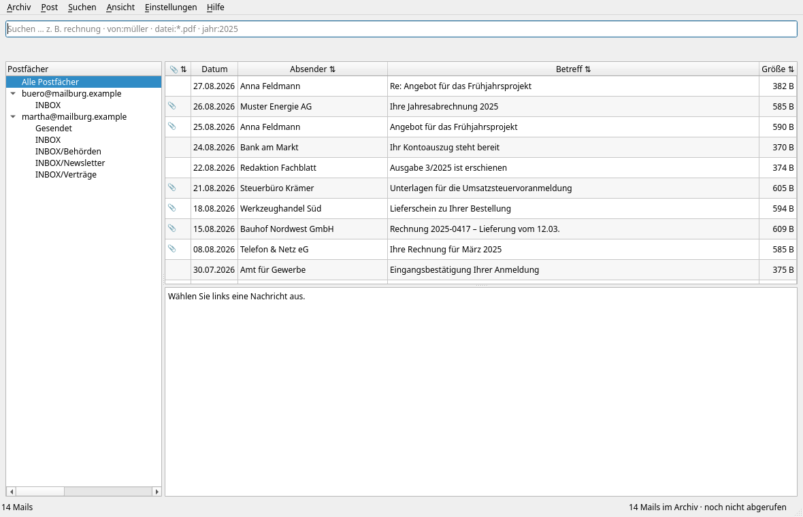
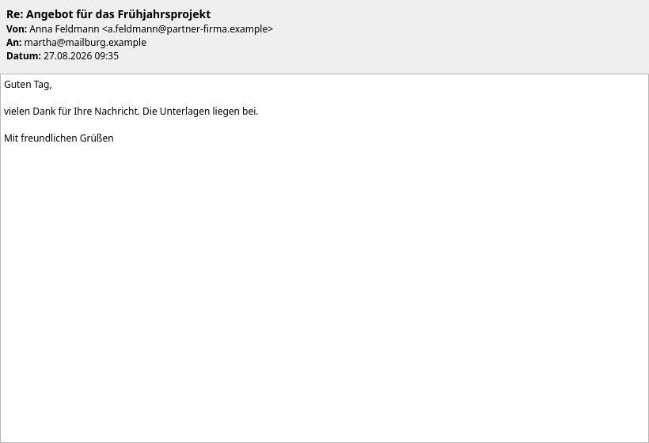
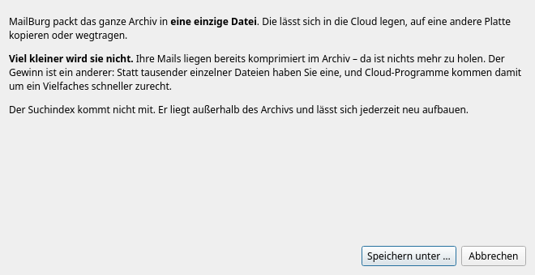
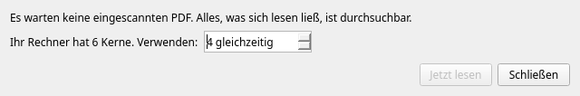
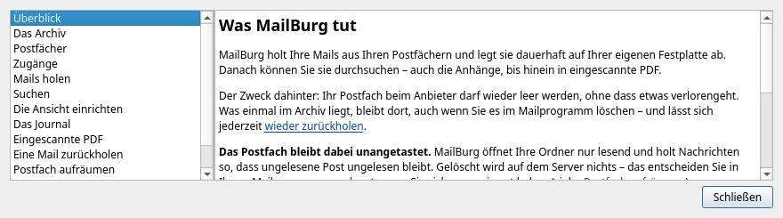

[Übersicht](../README.md) | [Anleitungen](README.md) | [Erste Schritte](erste-schritte.md) | [Postfach entlasten](postfach-entlasten.md) | [Sichern](sicherung.md)

# Die Oberfläche

Jedes Fenster und jeder Menüpunkt, mit Bild und Erklärung. Alle Abbildungen
zeigen erfundene Postfächer.

Dieselben Erklärungen stehen auch im Programm selbst unter **Hilfe → Handbuch**
(F1) – dort mit Sprungmarken zwischen den Kapiteln.

## Das Hauptfenster



Vier Bereiche:

**Oben das Suchfeld.** Schreiben Sie hinein, wonach Sie suchen. Darunter
erscheint das Ergebnis: *MailBurg hat 191 Treffer* oder *MailBurg hat nichts
gefunden*. Diese Zeile steht dort, wo Sie beim Tippen ohnehin hinsehen – bei
zweitausend Mails ist die Suche in Millisekunden durch, und eine Zahl am
unteren Fensterrand bemerkt dabei niemand.

**Links die Postfächer** mit ihren Ordnern und der Zahl der Mails. Ein Klick
grenzt die Suche darauf ein. Die Postfächer lassen sich anordnen – mit der Maus
oder über Strg+Auf und Strg+Ab.

**Rechts die Treffer.** Ein Klick auf einen Spaltenkopf sortiert, ein zweiter
dreht die Richtung um; das Zeichen ⇅ zeigt, welche Spalten sich sortieren
lassen. Die Büroklammer ganz links steht für Anhänge.

**Darunter die Vorschau** mit Kopfzeilen, Text und Anhängen. Anhänge lassen
sich öffnen oder speichern.

**Unten rechts steht immer**, wie viele Mails im Archiv liegen und wann zuletzt
abgerufen wurde. Das beantwortet die Frage, die sich vor jedem Aufräumen im
Mailprogramm stellt: *Ist mein Archiv auf dem Stand?*

### Eine Nachricht lesen



Ein **Doppelklick** in der Trefferliste öffnet die Nachricht in einem eigenen
Fenster – die Vorschau unten ist zum Überfliegen da, nicht zum Lesen. Mehrere
Fenster gleichzeitig sind möglich, etwa um zwei Rechnungen zu vergleichen.
Strg+W oder Esc schließt sie.

### Eine Nachricht zurückholen


Mit der **rechten Maustaste** auf eine Nachricht: *Im Postfach wiederherstellen*
legt sie in den Posteingang eines frei gewählten Postfachs – vollständig, mit
allen Anhängen und mit ihrem ursprünglichen Datum.

**Es muss nicht das Postfach sein, aus dem sie stammt.** Post überlebt
Arbeitgeber, Anbieter und Adressen.

Markiert wird sie als ungelesen. Das klingt nach einer Falschmeldung, ist aber
der einzige Weg, sie wiederzufinden: Mit ihrem alten Datum steht sie mitten in
der Post von damals.

*Als Datei speichern* schreibt stattdessen eine `.eml`-Datei. Die öffnet jedes
Mailprogramm und braucht weder Zugangsdaten noch ein erreichbares Postfach.

## Menü Archiv

**Neues Archiv anlegen …** – ein weiteres Archiv, etwa ein privates neben dem
geschäftlichen.

**Archiv wechseln …** – zu einem vorhandenen Archiv. Der Dialog kennt Ihre
angeschlossenen Platten.

**Zuletzt benutzt** – die zuletzt geöffneten Archive unter ihrem Namen. Wer
zwei Archive führt, wechselt hierüber mit zwei Klicks.

**Auskunft nach DSGVO …** *(nur im Geschäftsarchiv)*


Fragt jemand, was über ihn gespeichert ist, hat er nach Artikel 15 DSGVO
Anspruch auf eine Kopie. MailBurg sucht alle Nachrichten, in denen die Person
vorkommt, und packt sie auf Wunsch als ZIP – mit einem Begleitblatt, das
Herkunft, Zeitraum und Verarbeitungszweck nennt.

**Herausgegeben wird von Ihnen, nicht vom Programm.** In denselben Nachrichten
stehen oft Daten Dritter – Adressen im Verteiler, Namen im Text, Unterschriften
in Anhängen –, und nach Artikel 15 Absatz 4 darf die Kopie deren Rechte nicht
beeinträchtigen. Das steht im Fenster und noch einmal im Begleitblatt.

**Verfahrensdokumentation …** *(nur im Geschäftsarchiv)* – erzeugt einen
Entwurf nach GoBD. MailBurg füllt, was es selbst weiß; alles Organisatorische
bleibt als sichtbare Lücke stehen. Verantwortlich dafür sind Sie.

**Archiv sichern …**



Packt das ganze Archiv in eine einzige Datei. Viel kleiner wird sie nicht –
Ihre Mails liegen schon komprimiert –, aber aus zehntausend Dateien wird eine,
und damit kommen Cloud-Programme um ein Vielfaches schneller zurecht.

**Sicherung importieren …** – nimmt die Mails einer Sicherung in das *geöffnete*
Archiv auf, mit ihrem ursprünglichen Postfach und Ordner. Doppelte werden
erkannt; dieselbe Sicherung lässt sich gefahrlos zweimal einlesen.

**Sicherung in neues Archiv …** – macht daraus ein eigenes, neues Archiv. Das
Zielverzeichnis muss leer sein: Zwei Protokolle ineinander ergäben eines, das
sich nicht mehr prüfen lässt.

**Journal prüfen** – vergleicht das Protokoll mit dem, was tatsächlich auf der
Platte liegt, und prüft die Kette der Einträge. Nach jedem Zurückholen einer
Sicherung sinnvoll.

## Menü Post

**Jetzt abrufen (F5)** – holt sofort, was neu ist. Am Ende steht, ob alle
Postfächer erreichbar waren. **Räumen Sie nicht auf, solange dort eines fehlt.**

**Eingescannte PDF lesen …**



Die Zahl im Menü sagt, wie viele Dokumente noch ein weißes Blatt für die Suche
sind: eingescannte Seiten ohne Textebene. Die Texterkennung liest sie und legt
das Ergebnis in den Suchindex – **das Archiv selbst bleibt unangetastet**, die
PDF werden nicht verändert.

Etwa fünf bis acht Sekunden je Seite. Sie können das Fenster schließen und im
Hintergrund weiterlesen lassen; oben rechts steht dann der Stand, und Sie
können normal weitersuchen.

**Aufbewahrung festlegen …** *(nur im Geschäftsarchiv)*


Ordnet die **gerade gefundenen** Mails ein: Buchungsbeleg, Handelsbrief oder
privat. Davon hängt ab, wie lange MailBurg das Löschen bremst – sechs, acht
oder zehn Jahre.

Eingestuft wird über die Suche, nicht Mail für Mail. Wer ein Archiv einordnet,
hat hunderte Belege vor sich; »alles von der Steuerkanzlei ist Buchungsbeleg«
ist eine Regel, die sich als Suchausdruck schreiben lässt. Suchen Sie also
zuerst, und stufen Sie dann die Treffer ein.

Das Fenster sagt vorher, wie viele Mails betroffen sind und was die Wahl
bedeutet. Jede Änderung steht im [Journal](#journal) – wer später begründen
muss, warum eine Mail nach sechs statt acht Jahren gelöscht wurde, will darauf
zeigen können.

### Einmal im Jahr fragt MailBurg nach


Ab dem 1. Mai, und nur einmal je Kalenderjahr: MailBurg zeigt, was seine Frist
hinter sich hat. Nicht ab dem 1. Januar, wenn die Fristen ablaufen – eine
Meldung, die bei jedem Öffnen erscheint, wird nach der dritten Wiederholung
weggeklickt, ohne gelesen zu werden.

**Auch ein Privatarchiv fragt**, dort aber anders: Es gibt keine Fristen, also
zeigt es nur, was älter als zehn Jahre ist, und sagt ausdrücklich dazu, dass
Alter kein Grund zum Löschen ist. Gelöscht wird in beiden Fällen nichts von
selbst.

## Menü Suchen

**Ausführlich suchen … (Strg+F)**


Eine Maske mit Feldern für Absender, Empfänger, Betreff, Anhänge, Zeitraum,
Größe und Wichtigkeit. Unten zeigt sie den Suchausdruck, den sie daraus
zusammensetzt – so lernt man die Suchsprache nebenbei und kann den Ausdruck
kopieren.

Der Zeitraum lässt sich im Kalender wählen. Achten Sie auf die Trennung:
*Verschickt oder empfangen* meint das Datum der Mail, *Ins Archiv aufgenommen*
den Tag, an dem MailBurg sie geholt hat. Eine Mail von 2016 kann heute ins
Archiv gekommen sein.

## Menü Ansicht

**Fenster auf Standard zurücksetzen** – Größe und Aufteilung wie beim ersten
Start. Ihre gespeicherte eigene Ansicht bleibt erhalten.

**Postfach nach oben / nach unten (Strg+Auf, Strg+Ab)** – ordnet die Postfächer
an. Geht auch mit der Maus.

**Eigene Ansicht speichern / laden** – legt Größe, Aufteilung, Spaltenbreiten
und Reihenfolge ab. Gespeichert wird nur auf Befehl: Sonst überschriebe ein
versehentliches Verziehen die Ansicht, die Sie sich eingerichtet haben.

## Menü Einstellungen

**Postfächer verwalten …**


Postfächer hinzufügen, Passwörter ändern, stilllegen oder entfernen. Ein
stillgelegtes Postfach bleibt eingerichtet, wird beim Abruf aber übergangen –
nützlich für ein Konto, das es nicht mehr gibt. **Entfernen** nimmt es samt
Passwort aus der Liste; die bereits archivierten Mails bleiben in jedem Fall
erhalten.

**Was von selbst laufen soll (Automatisierung) …**


Zwei Dinge, die ohne Zutun laufen sollten:

*Neue Post regelmäßig holen* – alle 15 Minuten bis einmal täglich. MailBurg
muss dafür weder geöffnet bleiben noch mitstarten; nötig ist nur, dass Sie
angemeldet sind, weil daran der Schlüsselbund hängt. War der Rechner aus, wird
der versäumte Abruf nachgeholt.

*Das Archiv regelmäßig sichern* – täglich, wöchentlich oder monatlich in einen
Ordner Ihrer Wahl. Am besten einen, den Ihre Cloud abgleicht. **Nicht auf
dieselbe Platte wie das Archiv:** Eine Sicherung, die neben dem Original liegt,
geht mit ihm zusammen verloren.

## Menü Hilfe



**Handbuch … (F1)** – dieselben Erklärungen im Programm, nach Kapiteln
geordnet und untereinander verlinkt.

**Suchsprache …**, **Was das Journal ist …**, **Postfach aufräumen …**,
**Tipps …** – führen ins selbe Handbuch, nur gleich ans passende Kapitel.

## Die Bilder erneuern

Die Abbildungen entstehen aus einem Skript, nicht von Hand:

```bash
python werkzeuge/screenshots.py
```

Es legt ein kleines Archiv mit erfundener Post an, rendert die Fenster und
schreibt die Bilder nach `docs/bilder`. So veralten sie nicht still, wenn sich
die Oberfläche ändert – und es steht nie fremde Post darin.
