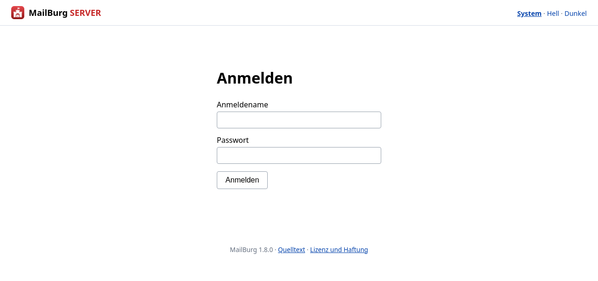
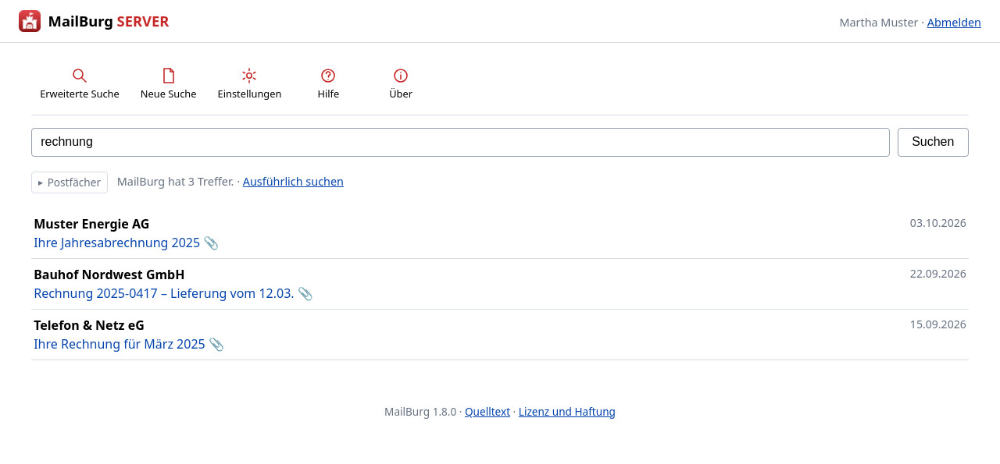

[Übersicht](../README.md) | [Anleitungen](README.md) | [Das Archiv im Browser](server-einrichten.md)

<p align="center">
  <picture>
    <source media="(prefers-color-scheme: dark)" srcset="../assets/server/banner-dark-1600.png">
    
  </picture>
</p>

# MailBurg auf einem Windows Server

Vom leeren Server bis zum Archiv im Browser. Rechnen Sie mit einer
halben Stunde – ohne das Kopieren eines großen Archivs.

> **Durchgespielt am 02.10.2026 auf einem Windows Server 2025.** Jeder
> Schritt auf dieser Seite ist dort einmal gelaufen, einschließlich
> Neustart. Was dabei noch offen blieb, steht am Ende unter
> [Was noch nicht erprobt ist](#was-noch-nicht-erprobt-ist) – ungeprüfte
> Stellen stehen dort und nicht zwischen den Schritten.

Für Debian und andere Linux-Systeme gilt
[Das Archiv im Browser einrichten](server-einrichten.md); dort läuft der
Dienst über systemd.

## Was der Server braucht

* **Python 3.11 oder neuer.** Empfehlung: 3.12 oder 3.13. Beim
  Installieren **»Add python.exe to PATH« ankreuzen** – sonst findet die
  PowerShell es nicht.
* **Internet für die Installation.** Ohne siehe
  [Ohne Internet](#ohne-internet-auf-dem-server).
* **Etwa 15 GB frei** für ein Archiv von 70.000 Mails: 13 GB Archiv,
  rund 1 GB Suchindex, Luft für den Neuaufbau.
* Alle Befehle in einer **PowerShell als Administrator**.

Git wird **nicht** gebraucht – auf einem Server ist es meist nicht
installiert, und die Anleitung kommt ohne aus.

## 1. MailBurg holen

```
cd C:\
Invoke-WebRequest https://github.com/Stephan-Lefty/MailBurg/archive/refs/heads/main.zip -OutFile mb.zip
Expand-Archive mb.zip -DestinationPath C:\mb-neu -Force
Move-Item C:\mb-neu\MailBurg-main C:\MailBurg
```

> **Das ZIP legt einen Unterordner an.** Aus `MailBurg-main.zip` wird
> `MailBurg-main\`, nicht `MailBurg\`. Deshalb das `Move-Item`. Gemeint
> ist immer der Ordner, in dem die `pyproject.toml` liegt.

## 2. Einrichten

```
cd C:\MailBurg
py -m pip install ".[server-windows,imap,anhaenge,packen,oberflaeche]"
```

> **Nicht** `pip install mailburg[...]` – MailBurg liegt nicht auf PyPI.
> Der Punkt vor der Klammer meint »das Verzeichnis hier«.

`oberflaeche` sind rund 150 MB Qt. Sie werden für das
Einrichtungsfenster gebraucht; der Dienst selbst rührt Qt nicht an.

## 3. pywin32 nachregistrieren

Ohne diesen Schritt startet kein Dienst. Der Pfad hängt davon ab, wo
Python liegt:

```
py C:\Users\Administrator\AppData\Local\Programs\Python\Python312\Scripts\pywin32_postinstall.py -install
```

Findet PowerShell das Skript nicht:

```
py -c "import sys,os; print(os.path.join(sys.prefix,'Scripts'))"
```

Am Ende muss dort stehen: *The pywin32 extensions were successfully
installed.*

## 4. Das Einrichtungsfenster

```
py -m mailburg.ui.servereinrichtung
```

Aus einer **PowerShell als Administrator** – sonst bleiben Dienst und
systemweite Einstellungen gesperrt. Das Fenster sagt es selbst, in der
Zeile *Rechte*.

Es zeigt eine Prüfliste. Jede Zeile hat ein Zeichen davor:

| | |
|---|---|
| ✓ | in Ordnung |
| ✗ | fehlt, und ohne das geht es nicht weiter |
| ! | geht, ist aber nicht ideal |
| ? | lässt sich hier nicht feststellen |

Wo etwas fehlt, steht rechts der Knopf, der es behebt.

## 5. Der gemeinsame Ordner

**Der Schritt, an dem ein Serverbetrieb still scheitert.** Tragen Sie
unter *Gemeinsamer Ordner* einen Pfad ein, etwa:

```
C:\MailBurg-Daten
```

Dort landen Suchindex, Kontenliste und Tresor.

Warum das nötig ist: Der Dienst läuft als `LocalSystem` und hat ein
anderes Benutzerprofil als der Mensch, der das Archiv einrichtet. Ohne
gemeinsamen Ordner sucht er den Index unter
`C:\Windows\System32\config\systemprofile` – und findet nichts. **Die
Anmeldung geht trotzdem**, denn die Zugänge liegen im Archiv. Jede Suche
bleibt leer, ohne dass irgendwo ein Fehler steht.

## 6. Das Archiv

Zum Ausprobieren legt der Knopf *Vorführarchiv anlegen …* eines mit 27
erfundenen Mails an; alle Adressen enden auf `.example`.

Für ein vorhandenes Archiv: Den Ordner auf eine **lokale Platte** des
Servers kopieren, keine Netzwerkfreigabe – `LocalSystem` kommt an eine
Freigabe nicht heran. Dann im Fenster über *Suchen …* wählen.

Ein Archiv ist ein gewöhnlicher Ordner; kopieren genügt. **Der Suchindex
kommt nicht mit**, er wird gleich neu gebaut.

## 7. Index bauen

Nur nötig, wenn ein vorhandenes Archiv kopiert wurde:

```
$env:MAILBURG_DATEN = "C:\MailBurg-Daten"
py -m mailburg neuaufbau C:\Pfad\Zum\Archiv
```

**Die erste Zeile ist entscheidend.** Ohne sie landet der Index in Ihrem
Benutzerprofil, und der Dienst sieht ihn nicht.

Bei 70.000 Mails rechnen Sie mit Minuten, nicht Sekunden.

### Der Text in den PDF-Anhängen

MailBurg liest PDF-Anhänge mit, damit auch Rechnungsnummern gefunden
werden, die nirgends im Mailtext stehen. Dafür gibt es zwei Wege:

| | |
|---|---|
| `pdftotext` aus poppler | deutlich schneller, in C geschrieben – wird genommen, wenn vorhanden |
| `pypdf` | der Rückfall in Python, kommt mit dem Extra `anhaenge` |

Auf einem frischen Windows Server ist nur `pypdf` da. Das genügt, nur
dauert der Neuaufbau länger. Wer ein großes Archiv mit vielen
PDF-Rechnungen überträgt, legt besser poppler dazu und nimmt den
schnellen Weg – welche Fassung dafür die richtige ist, hängt am Server
und steht in dieser Anleitung bewusst nicht aus dem Gedächtnis.

**Am Ende des Laufs steht, was auffiel** – gebündelt, nicht Zeile für
Zeile:

```
Beim Lesen der PDF-Anhänge gab es 312 Hinweise (nicht Dateien – ein PDF kann mehrere auslösen):
  298× EOF marker not found
   14× Ignoring wrong pointing object

Die betroffenen Mails sind archiviert und werden gefunden –
nur der Text aus diesen Anhängen fehlt im Index.
```

`EOF marker not found` heißt: Dem PDF fehlt die Schlusszeile. Bei
Mailanhängen ist das häufig und meistens harmlos.

## 8. Zugänge

Im Fenster über *Zugänge …* – einen je Mensch, mit den Postfächern, die
er sehen darf. Ohne Zugang kommt niemand über die Anmeldeseite hinaus.

Das Passwort braucht mindestens zehn Zeichen. Nehmen Sie **keine
Sonderzeichen**: Es wird in der PowerShell blind getippt und im Browser
sichtbar – weichen die Tastaturlayouts ab, wie es bei einer
Fernwartungssitzung vorkommt, kommen Sie nicht hinein und suchen am
falschen Ende.

## 9. Übernehmen und Dienst starten

Im Fenster in dieser Reihenfolge:

1. **Übernehmen** – schreibt die Einstellungen dorthin, wo der Dienst
   sie liest
2. **Dienst einrichten**
3. **Starten**
4. **Neu prüfen** – alle Zeilen müssen grün sein

Die Zeile *Start beim Hochfahren* muss **Automatisch (verzögert)**
zeigen. Steht dort *Manuell*, drücken Sie den Knopf daneben: Ein Dienst
auf »manuell« kommt nach einem Neustart des Servers nicht wieder, und
niemand bekommt eine Meldung darüber.

Zur Kontrolle:

```
sc.exe qc MailBurgServer
```

Dort muss `START_TYPE : 2 AUTO_START (DELAYED)` stehen.

> `sc` allein genügt nicht – in PowerShell ist das ein anderer Befehl
> (`Set-Content`). Die Endung `.exe` gehört dazu.

## 10. Symbole auf den Schreibtisch

Der Knopf **Symbole anlegen** legt drei Verknüpfungen auf den
Schreibtisch aller Benutzer:

| | |
|---|---|
| **MailBurg starten** | prüft den Dienst, wartet notfalls, öffnet den Browser |
| **MailBurg im Browser** | direkt zur Weboberfläche |
| **MailBurg einrichten** | dieses Fenster |

## 11. Von den Arbeitsplätzen aus

Im Fenster bei *Erreichbar* auf **auch im Netz** stellen, **Übernehmen**,
Dienst **Anhalten** und **Starten**. Dazu die Firewall:

```
New-NetFirewallRule -DisplayName "MailBurg" -Direction Inbound -LocalPort 8383 -Protocol TCP -Action Allow
```

Dann von einem Arbeitsplatz `http://SERVERNAME:8383/`.

> **HTTP heißt Klartext.** Anmeldename und Passwort gehen ungeschützt
> durchs Netz. Im eigenen Firmennetz ist das vertretbar, auf Dauer
> nicht: Davor gehört ein Reverse Proxy mit TLS, unter Windows der IIS.

**Auf den Arbeitsplätzen wird nichts installiert.** Sie brauchen einen
Browser, mehr nicht – und ein Update auf dem Server erreicht alle
gleichzeitig.

### Was die Mitarbeiter zu sehen bekommen

Zuerst die Anmeldung. Mehr steht dort nicht – wer nicht angemeldet ist,
erfährt nicht einmal, wie das Archiv heißt.



Nach der Anmeldung die Suche. Links stehen nur die Postfächer, die
dieser Zugang sehen darf; die Zahl dahinter ist die der Nachrichten
darin.



Unter **Einstellungen** stellt jeder für sich ein, wie es aussehen soll.
Die Einstellung hängt am Browser, nicht am Zugang – wer sich von einem
anderen Rechner anmeldet, fängt wieder bei der Vorgabe an.


Und eine **Hilfe**, die im Programm steht und nicht in einer Datei, die
niemand findet:


## 12. Post abrufen: der Tresor

Nur nötig, wenn der Server selbst Postfächer abrufen soll.

Der Dienst hat kein Benutzerprofil und damit keinen Schlüsselbund. Die
Passwörter liegen deshalb verschlüsselt in einer Datei, deren
Hauptschlüssel woanders steht.

Im Fenster: **Tresor einrichten …** Das erzeugt den Hauptschlüssel und
trägt seinen Ort beim Dienst ein.

Die Passwörter selbst kommen vom Rechner, der die Postfächer kennt:

```
mailburg tresor uebernehmen
```

Dann `konten.json` und `tresor.json` in den gemeinsamen Ordner auf dem
Server kopieren.

> **Schlüsseldatei und Tresordatei nie zusammen weitergeben und nie
> zusammen sichern.** Wer beides hat, hat die Postfächer.

Und auf dem Server nachsehen, ob es für alle reicht:

```
mailburg tresor pruefen
```

Der Befehl sagt nicht nur, ob sich die Einträge öffnen lassen, sondern
auch, **ob für jedes eingerichtete Postfach eine Anmeldung dabei ist** –
und ob Einträge mitgekommen sind, zu denen hier kein Postfach gehört.
Das ist wichtiger, als es klingt: Ein Postfach ohne Passwort wird beim
Abruf übersprungen, ohne dass etwas rot wird. Der Dienst läuft weiter,
die Statusseite ist grün, und es kommt nur nichts mehr an.

## Ohne Internet auf dem Server

Auf einem Rechner **mit** Internet, gleiche Python-Fassung und
Architektur:

```
py -m pip download ".[server-windows,imap,anhaenge,packen,oberflaeche]" -d C:\wheels
```

Den Ordner mitnehmen, auf dem Server:

```
py -m pip install --no-index --find-links C:\wheels ".[server-windows,imap,anhaenge,packen,oberflaeche]"
```

> Dieser Weg ist **nicht erprobt**.

## Aktualisieren

Im Einrichtungsfenster: **Nach Updates sehen**, dann **Update
installieren**. Es lädt die neueste veröffentlichte Fassung, installiert
sie aus einem Wegwerfverzeichnis und startet den Dienst durch. Der
Programmordner bleibt unberührt.

Gefragt wird nach *Releases*, nicht nach dem letzten Stand der
Entwicklung – ein Archivserver soll keine Zwischenstände ziehen.

## Wenn etwas klemmt

Die Prüfliste als Text, zum Kopieren in eine Fehlermeldung:

```
py C:\MailBurg\werkzeuge\start_server_einrichten.py --pruefen
```

Was der Dienst von sich hält:

```
curl.exe -s http://127.0.0.1:8383/zustand.json
```

Die Zahl bei `"mails"` ist die wichtigste. Steht dort 0, während das
Archiv voll ist, liest der Dienst einen anderen Index als Sie – siehe
[Der gemeinsame Ordner](#5-der-gemeinsame-ordner).

Warum der Dienst nicht startet, steht im Ereignisprotokoll, nicht auf
der Konsole:

```
$alle = Get-WinEvent -LogName Application -MaxEvents 50
$alle | Where-Object { $_.Message -match "MailBurg" } | Format-List
```

Denselben Auszug holt im Fenster der Knopf *Ereignisprotokoll holen*.

## Was noch nicht erprobt ist

Diese Punkte sind gebaut, aber nicht im Betrieb gelaufen. Sie stehen
hier und nicht zwischen den Schritten, damit niemand sie für erprobt
hält:

* **Der Tresor als LocalSystem.** Der Weg ist gebaut und die Prüfung
  meldet richtig; ob der Dienst damit wirklich Post holt, hat noch
  niemand gesehen.
* **Der Weg ohne Internet** (Wheelhouse).
* **Ein Archiv auf einer zweiten Platte.** Der Dienst startet verzögert,
  damit sie beim Hochfahren bereitsteht – nachgemessen ist das nicht.
* **Mehr als ein paar Zugänge gleichzeitig.** Geprüft ist die
  Rechtetrennung, nicht das Verhalten unter Last.

Ein Punkt gilt dagegen als geklärt: Der Dienst **übersteht einen
Neustart des Servers**. Am 02.10.2026 gemessen – Rechner um 15:13:07
hochgefahren, Dienst um 15:15:28 von selbst oben, ohne Anmeldung.
