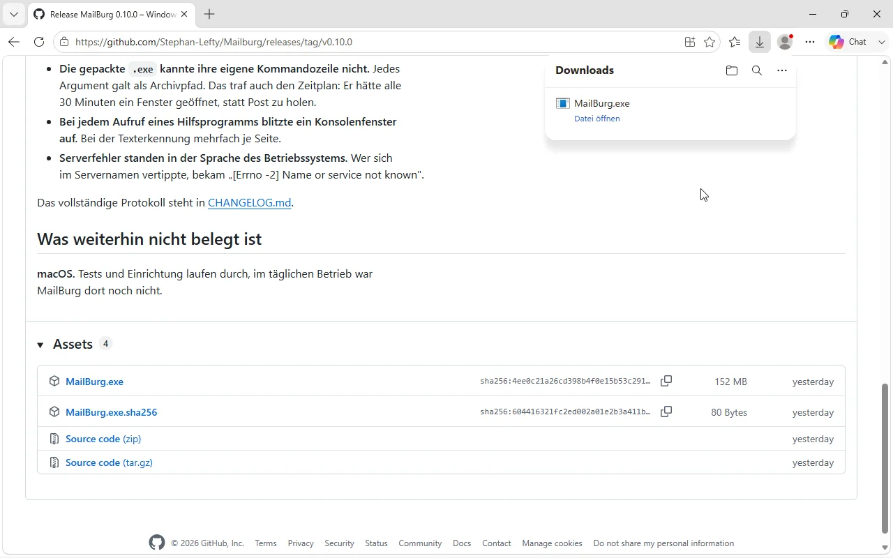
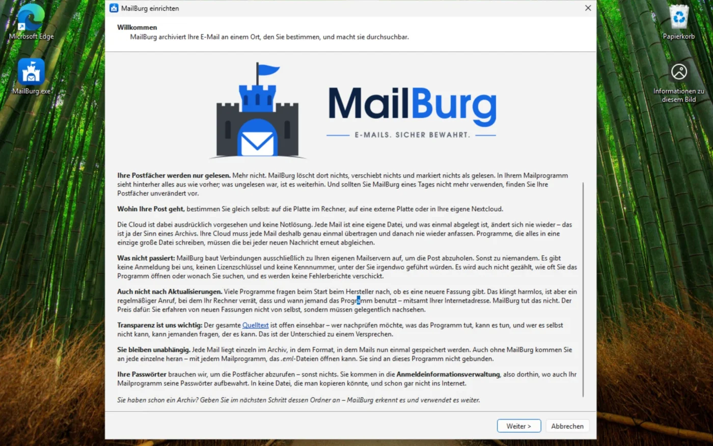
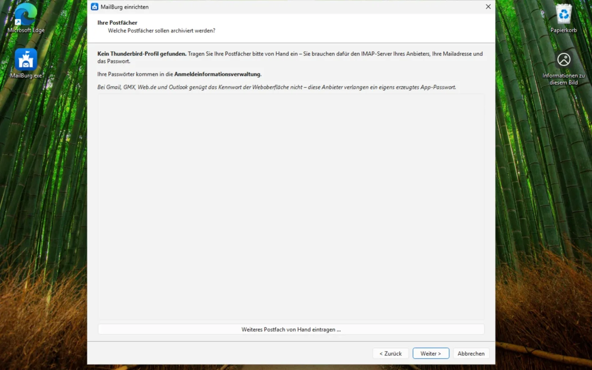
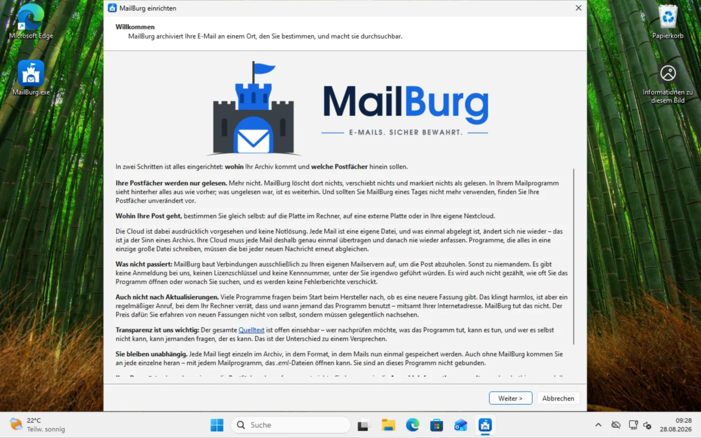

[Übersicht](../README.md) | [Anleitungen](README.md) | [Erste Schritte](erste-schritte.md) | [Postfächer](postfaecher-einrichten.md) | [Zeitsteuerung](zeitsteuerung.md) | [Postfach entlasten](postfach-entlasten.md) | [Sichern](sicherung.md)

# MailBurg unter Windows

Eine Datei herunterladen, doppelklicken, fertig. Python wird nicht gebraucht,
installiert wird nichts, Administratorrechte braucht es nicht.

## Herunterladen

Die aktuelle `MailBurg.exe` hängt an der
[jüngsten Veröffentlichung](https://github.com/Stephan-Lefty/MailBurg/releases/latest).
Daneben liegt eine Datei `MailBurg.exe.sha256` mit der Prüfsumme.

Nachrechnen, ob die Datei unterwegs unverändert geblieben ist:

```powershell
Get-FileHash .\MailBurg.exe -Algorithm SHA256
```

Der angezeigte Wert muss mit dem in der `.sha256`-Datei übereinstimmen.



## Windows wird warnen

**Beim Herunterladen mit Edge.** Nach dem Laden meldet er: *„MailBurg.exe
wird häufig nicht heruntergeladen. Stellen Sie sicher, dass Sie MailBurg.exe
vertrauen, bevor Sie sie öffnen."* Das ist keine Aussage über den Inhalt,
sondern über die Häufigkeit: Der Zähler steht bei einem Programm mit einer
Handvoll Anwender nun einmal niedrig.

Die Datei ist da, aber Edge wirft sie weg, wenn Sie nichts tun. Fahren Sie mit
der Maus über die Warnung; es erscheinen ein Papierkorb und drei Punkte. Unter
den drei Punkten steht **Beibehalten**.

> **Achtung, hier ist die Führung heikel.** Danach fragt Edge noch einmal
> nach, und die beiden Knöpfe heißen *Abbrechen* und *Löschen*. **Löschen ist
> der hervorgehobene** — wer gedankenlos die Eingabetaste drückt, hat die
> Datei weggeworfen. Zum Behalten klicken Sie auf den kleinen Pfeil **neben**
> „Löschen" und wählen dort **Trotzdem beibehalten**.
>
> Das ist keine Eigenheit von MailBurg; jede unsignierte Datei bekommt diese
> Behandlung.

**Danach startet sie ohne weitere Nachfrage.** Am 29. August 2026 in einer
frischen Windows-11-Installation durchgespielt: Wer in Edge »Trotzdem
beibehalten« gewählt hat, bekommt beim Doppelklick keine zweite Warnung mehr.

**Kommt die Datei anders auf den Rechner** — über einen USB-Stick, aus einem
anderen Browser, aus einem Netzlaufwerk —, kann beim ersten Start
*„Der Computer wurde durch Windows geschützt"* erscheinen. Dann:
**Weitere Informationen** → **Trotzdem ausführen**.

## Warum überhaupt gewarnt wird

SmartScreen kennt zwei Wege, eine Anwendung für unbedenklich zu halten: Sie ist
von einem gekauften Zertifikat signiert, oder sie wurde bereits von vielen
Leuten heruntergeladen und ausgeführt. MailBurg ist beides nicht — ein
Signaturzertifikat kostet dreistellig im Jahr, und die Zahl der Anwender ist
überschaubar.

Wem das zu wenig ist: Die Prüfsumme oben lässt sich nachrechnen, der Quellcode
liegt offen, und die `.exe` wird nicht auf einem Privatrechner gebaut, sondern
von GitHub selbst — das
[Bauprotokoll](https://github.com/Stephan-Lefty/MailBurg/actions/workflows/windows-exe.yml)
zeigt für jede Fassung, aus welchem Stand sie entstanden ist.

## Einrichten

Doppelklick, und der Assistent führt durch vier Schritte:



1. **Wofür** — privat oder geschäftlich. Die Wahl entscheidet über
   Aufbewahrungsfristen und Löschregeln und lässt sich später nicht ohne
   Weiteres umstellen.
2. **Wohin** — der Ordner für das Archiv. Vorgeschlagen wird
   `Dokumente\MailBurg-Archiv`.
3. **Postfächer** — Serveradresse, Benutzername, Passwort. Der Verbindungstest
   sagt Ihnen sofort, ob die Anmeldung klappt und wie viele Ordner archiviert
   würden.

   

   Findet MailBurg ein Thunderbird-Profil, stehen dessen Konten hier schon
   drin und müssen nur noch angekreuzt werden. Sonst tragen Sie sie von Hand
   ein.
4. **Fertig** — mit dem Häkchen „Jetzt den ersten Abruf starten" läuft der
   erste Durchgang gleich los.

   

Der erste Abruf holt **alles**, was in den Postfächern liegt. Bei einem
gewachsenen Bestand kann das eine Stunde dauern. Jeder weitere Lauf holt nur
noch Neues und ist in Sekunden durch. Abbrechen ist unbedenklich: Der nächste
Abruf macht dort weiter, wo der vorige aufgehört hat.

## Eingescannte PDF durchsuchbar machen

**Das ist bereits eingebaut.** Mehr als die Hälfte der PDF in einem gewachsenen
Postfach sind Scans — die Handwerkerrechnung, der Bescheid vom Amt, der
unterschriebene Vertrag. Ohne Texterkennung stehen sie im Archiv und sind doch
nicht zu finden, und das ausgerechnet bei den Dokumenten, die man später sucht.

Die `MailBurg.exe` bringt poppler und tesseract mitsamt deutschen Sprachdaten
selbst mit. Nachinstallieren müssen Sie nichts. Nachsehen können Sie es:

```powershell
.\MailBurg.exe werkzeuge
```

Steht dort `Texterkennung: ja` und bei den Sprachen `deu`, ist alles beisammen.

Die Erkennung läuft im Hintergrund, nicht beim Abruf — sie braucht fünf bis
dreißig Sekunden je Seite, und niemand soll darauf warten. Was dabei
herauskommt, wandert in den Suchindex; das Dokument selbst bleibt unangetastet.
Alles andere wäre das Ende der Unveränderbarkeit und damit des Zwecks.

## Regelmäßig abrufen

*Einstellungen → Was von selbst laufen soll* → Häkchen bei „Neue Post
regelmäßig im Hintergrund holen", Abstand wählen, Übernehmen.

MailBurg legt dafür eine Aufgabe im Ordner **MailBurg** der
Windows-Aufgabenplanung an, je Archiv eine eigene. Verwaltungsrechte braucht es
nicht. MailBurg muss dafür weder geöffnet bleiben noch in den Autostart —
geholt wird ohne Fenster.

Nötig ist nur, dass Sie angemeldet sind: Die Passwörter liegen in der
Anmeldeinformationsverwaltung, und die öffnet sich erst mit der Anmeldung. War
der Rechner aus, wird der versäumte Abruf beim nächsten Anmelden nachgeholt.

Nachsehen:

```powershell
Get-ScheduledTask -TaskPath "\MailBurg\" | Format-List TaskName, State
```

Einzelheiten in [zeitsteuerung.md](zeitsteuerung.md).

## Wo was liegt

| Was | Wo |
|-----|-----|
| Programm | wohin Sie die `.exe` gelegt haben |
| Einstellungen und Kontenliste | `%APPDATA%\MailBurg` |
| Suchindex | `%LOCALAPPDATA%\MailBurg` |
| Passwörter | Anmeldeinformationsverwaltung |
| Zeitpläne | Aufgabenplanung, Ordner `MailBurg` |
| Archiv | wo Sie es angelegt haben |

Die Trennung ist Absicht: Einstellungen liegen im wandernden Profil (`APPDATA`)
und wandern in einer Domäne mit, der Suchindex liegt lokal (`LOCALAPPDATA`).
Der kann zweistellige Gigabyte erreichen — den über das Netz zu
synchronisieren, wäre eine Zumutung.

Die Passwörter stehen unter *Systemsteuerung → Anmeldeinformationsverwaltung →
Windows-Anmeldeinformationen*, die Einträge beginnen mit
`de.stephanlefty.MailBurg`.

## Thunderbird und Outlook

Ein vorhandenes **Thunderbird**-Profil wird gefunden und mitsamt aller Konten
und Ordner eingelesen — im Assistenten unter „Vorhandene Mails übernehmen",
oder von Hand:

```powershell
.\MailBurg.exe importieren $env:USERPROFILE\Documents\MailBurg-Archiv `
    "$env:APPDATA\Thunderbird\Profiles\xxxxxxxx.default" --konto alt
```

**Outlook**-Archive (`.pst`, `.ost`) kann MailBurg noch nicht lesen. Der Weg
dahin führt über `libpff` und steht auf der Liste.

**Der IMAP-Weg braucht bei Microsoft OAuth2.** Outlook.com, Hotmail und
Exchange Online verlangen seit dem 16. September 2024 beziehungsweise dem
1. Oktober 2022 ausschließlich OAuth2; App-Kennwörter funktionieren dort nicht
mehr. MailBurg beherrscht das seit dem 29. August 2026 — siehe
[Anmeldung per OAuth2](oauth2.md). Sie registrieren sich dafür eine eigene
Anwendung, kostenlos und in fünf Minuten.

Alternativ: In Outlook den Ordner als `.eml` exportieren, oder das Konto
zusätzlich in Thunderbird einrichten und MailBurg das Profil einlesen lassen.

## Wieder loswerden

MailBurg installiert sich nicht, es gibt also nichts zu deinstallieren. Die
`.exe` löschen genügt. Was stehen bleibt, muss bewusst weg:

```powershell
Remove-Item -Recurse -Force "$env:APPDATA\MailBurg"
Remove-Item -Recurse -Force "$env:LOCALAPPDATA\MailBurg"
Unregister-ScheduledTask -TaskPath "\MailBurg\" -Confirm:$false
```

Das Archiv und die gespeicherten Passwörter bleiben davon unberührt — das
Archiv, weil es Ihre Post ist, die Passwörter, weil sie Windows gehören. Beides
entfernen Sie selbst, wenn Sie es wollen.

## Aus den Quellen betreiben

Wer mitentwickeln oder die Kommandozeile ohne die gepackte Fassung benutzen
will, braucht Python 3.11 oder neuer:

```powershell
winget install Python.Python.3.13
```

Wer von [python.org](https://www.python.org/downloads/) installiert, muss beim
Setup **„Add python.exe to PATH"** ankreuzen — ohne das findet die
Eingabeaufforderung Python später nicht.

Dann in PowerShell, im MailBurg-Ordner:

```powershell
.\install.ps1
```

Lässt Windows das Skript nicht zu, hilft für dieses eine Fenster:

```powershell
Set-ExecutionPolicy -Scope Process -ExecutionPolicy Bypass
```

Für die Texterkennung fehlen dann noch die beiden Hilfsprogramme, die die
gepackte Fassung mitbringt:

```powershell
winget install oschwartz10612.Poppler
winget install UB-Mannheim.TesseractOCR
```

Beim tesseract-Setup das Häkchen bei **German** unter den Sprachdaten nicht
vergessen — ein deutscher Text mit englischem Modell gelesen wird zu
Buchstabensalat mit zerstörten Umlauten. Beide `bin`-Ordner müssen anschließend
im Suchpfad stehen. Ob es geklappt hat:

```powershell
mailburg werkzeuge
```
